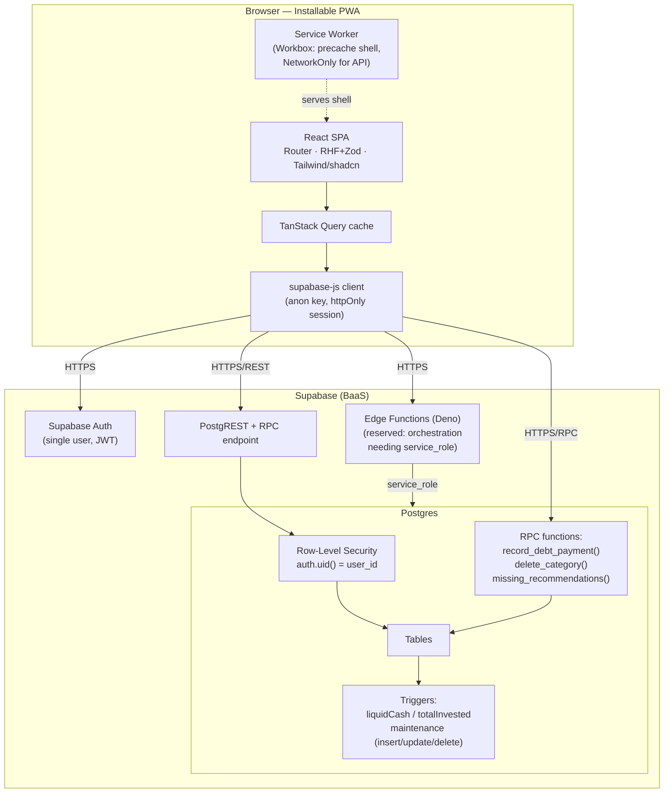
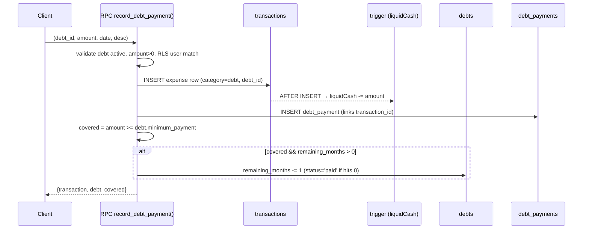

# Budget Manager — Architecture & Implementation Plan

**Status:** Implemented through Phase 7, with post-approval revisions (see §21)
**Type:** Single-user, installable, online-only PWA
**Backend:** Supabase (Postgres + Auth + RLS + Edge Functions)
**Money:** Integer centavos, single currency **MXN**

> **Revisions after approval.** Several decisions below were changed in use, with the
> product owner's sign-off. Each is marked **Revised** or **Superseded** inline and
> cites the migration that implements it. **§21 is the changelog** — read it before
> trusting any statement in this document against the running code. The locked
> decisions in the next section remain unchanged.

---

## Locked Architectural Decisions

These were confirmed by the product owner and are not re-litigated:

1. **PWA is installable and online-only.** Service worker caches the app shell/assets; all data operations require a network connection. No local-first / offline sync / conflict resolution.
2. **Running-total integrity lives in Postgres.** Triggers and RPC functions atomically adjust the saved `totals` row on every insert/update/delete. The client only *reads* totals.
3. **Single currency (MXN).** All monetary amounts stored as integer minor units (centavos). No FX logic.
4. **Supabase is the backend (BaaS).** Postgres + Auth + RLS + Edge Functions. RPC functions for atomic multi-step operations. No separate self-hosted API server.

---

## Part 0 — Resolved Decisions & Assumptions

### 0.1 Resolved decisions (previously open questions)

| # | Topic | Decision |
|---|-------|----------|
| D1 | **`totalInterestMoney` semantics** | Redefined using **market value**. Each investment vehicle has a `market_value_cents`. `totalMarketValue = SUM(market_value_cents)`. **`totalInterestMoney = totalMarketValue − totalInvested`** (derived, not stored). Percentage = `totalInterestMoney / totalInvested × 100`, guarded against divide-by-zero. <br>**Revised (0025):** `market_value_cents` is no longer *purely* manual. Every contribution now adds its amount to it (§7.7), because leaving it flat while `totalInvested` rose reported an instant loss equal to the amount just contributed — adding money is not a loss. It remains hand-editable for real gains/losses; the derivation above is unchanged. |
| D2 | **Do contributions reduce `liquidCash`?** | **No.** A contribution affects only `totalInvested` / per-vehicle totals, never `liquidCash`. *(Unchanged.)* |
| D3 | **Recommended-item match key** | ~~Match on **category + month + year**.~~ <br>**Superseded (0029): match on `description` + period.** An item is covered when a transaction **of the same type** whose description equals the item's — trimmed and case-folded, not a substring — falls in the period. Category is **organisational only** and plays no part in matching. <br>*Why:* the category rule allowed only one recommendation per category — any expense in that category covered every item sharing it, so "Agua" and "Luz" under Casa could not coexist. Description is also the only key that works for income, which carries no category at all (D11). Consequence: a blank description could never be satisfied, so it is rejected at the Zod boundary **and** by a CHECK. |
| D4 | **Debt overpayment** | A payment covering the minimum decrements **exactly one month**. Additionally, `remaining_months` is **manually editable** (bounded `0 … total_months`). |
| D5 | **Deleting a debt** | **Soft delete / archive** (`status='archived'`); payment history and `liquidCash` preserved. |
| D6 | **Multiple covering payments per month** | **Allowed**; each covering payment decrements one month; UI **warns** if the debt already has a covering payment that month. |
| D7 | **`due_day` on short months** | **Clamp** to the month's last day (e.g., 31 → Feb 28/29). |
| D8 | **Auth provisioning & recovery** | **Supabase admin dashboard only.** No password-reset or MFA UI, no self-serve flows. App has a login screen only. |
| D9 | **Category name collisions** | Rejected via `UNIQUE(user_id, name)` on both create and rename. |
| D10 | **Year view granularity** | Per-month income/expense/balance/invested first; category matrix deferred. |

### 0.1.1 Decisions added after approval

| # | Topic | Decision |
|---|-------|----------|
| D11 | **Does an income have a category?** | **No** (0022). Only expenses are classified; `transactions.category_id` is nullable and a CHECK pins both halves — income MUST have none, expense MUST have one. Enforcing both directions means a type flip cannot strand a category: the update has to clear or set it in the same statement. The income table drops the column entirely and `EntryForm` hides the field. Revises FR-4. |
| D12 | **Recommendation repeat modes** | A recommended item repeats `monthly` (default; every month its window overlaps), `yearly` (only the anniversary month of `window_start`), or `none` (a one-off) — 0023/0026. The mode is a **filter over the derived query, not a generator**: no rows are materialized per period, preserving §7.5. |
| D13 | **When is a one-off "paid"?** | **Ever, since `window_start`** (0028). A `none` item is covered by any matching transaction from its start date up to the end of the queried period. Repeating items keep per-period coverage — rent is owed again every month. *Why:* checking a one-off per-month meant something paid in Aug 2025 looked unpaid in every later month, sat in Pendientes forever and the banner nagged indefinitely. The upper bound keeps historical queries honest: a later payment cannot retroactively cover an earlier month. |
| D14 | **When does a window expire?** | **The day after `window_end`** (0028), not the month after. Measured against a reference day: *today* (America/Mexico_City) when the queried period is the current month, else that month's first day — so a historical query never expires an item inside its own window. An item expiring **today** is still pending. Deliberately finer than the coverage match, which stays month-granular: *"is the window still open?"* is a question about now, while *"was it paid?"* is a question about a period. |
| D15 | **Pending vs. past split** | Past = `is_expired OR is_covered`; pending = everything else. The three status flags are **independent facts** and coverage is never inferred from absence in the "missing" list — that list also omits items which are merely *not due* (a `yearly` item is absent 11 months a year), which would misfile them as past. Accepted consequence: a `monthly` item moves between the two tables as it is covered each month, and the past table mixes "done this month" with "expired" — hence its label, *"Ya registradas o vencidas"*. |
| D16 | **Completing a recommendation in one click** | The banner's *Completada* button writes a plain transaction — **no RPC**: it is a single insert, so there is no multi-step atomicity to protect (contrast §7.2). It only ever fills in what the user would have typed: the item's own description (verbatim — being the match key, that is precisely what then clears the item), its `expected_amount_cents`, dated today; `recurrence` = `recurrent` for a repeating item, `variable` for a one-off. <br>**Nothing is invented.** With no `expected_amount_cents` there is no honest amount to write, so it opens the prefilled `EntryForm` and asks for that one unknown field instead of guessing. <br>**Category fallback:** an expense MUST carry a category (D11) but a recommendation's category is *optional*, so a category-less expense item resolves to **Otros** — the category that exists for exactly this. Income always resolves to `null`. |
| D17 | **Category filter is expenses-only** | Income carries no category (D11), so a category-scoped month view has **no income and no meaningful balance**. Selecting a category therefore hides the income table and drops the *Ingresos* / *Balance* tiles rather than rendering a `$0` income beside a filtered expense total — which would make *Balance* read as full-income − filtered-expense, a number that means nothing. *Invertido* stays: it is an independent month fact that no table filter touches. This preserves **AC-Month/Year views** (*period totals equal the sum of the displayed rows*). |

### 0.2 Assumptions

1. Single user, single currency (MXN), one Supabase project; auth account provisioned manually via the Supabase admin dashboard. RLS is built as if multi-user for future-proofing.
2. Online-only. Service worker caches the **app shell only**; all data reads/writes require network.
3. Line-item amounts fit `INTEGER` centavos (max ≈ $21,474,836.47 MXN/row); denormalized **totals use `BIGINT`**.
4. `recurrent`/`variable` is a **pure label** for filtering/visualization — no auto-generation of entries.
5. Investments = vehicles (GBM, Cetes); contributions = money-add events; per-vehicle and grand totals are trigger-maintained.
6. Amounts stored **positive**; sign is derived from `type` (expense/income).
7. Deployment: static SPA on Vercel/Netlify/Cloudflare Pages; backend fully managed by Supabase.
8. Timezone `America/Mexico_City` for month/due-day logic; dates stored as `DATE` (no time) to avoid TZ drift.

---

## 1. Executive Summary

The Budget Manager is an **installable, online-only Progressive Web App** for a single household budget, built with **React + Vite** on the front end and **Supabase** (managed Postgres, Auth, Row-Level Security, Edge Functions) as the entire backend. It tracks expenses, incomes, debts, and investment contributions in **Mexican pesos stored as integer centavos**, and surfaces an always-current picture of liquid cash on hand, total invested, market value, and pending debts.

The defining architectural stance is that **financial integrity lives in the database, not the client.** A denormalized `totals` row holds `liquidCash` and `totalInvested`; Postgres triggers atomically adjust these on every transaction and contribution insert/update/delete (including the update-by-delta case). Multi-step money operations that must be all-or-nothing — applying a debt payment (which both creates a cash-affecting transaction *and* decrements the debt's remaining months) and deleting a category (which must reassign orphaned records to "Otros") — run inside **single Postgres RPC functions**, giving transactional atomicity for free. The client only ever *reads* the saved totals.

Security is enforced via **Row-Level Security keyed to `auth.uid()`** on every table, so although v1 is single-user, a second user could be added with zero schema rewrites. The public `anon` key ships to the browser (by design); the `service_role` key never leaves the server. Money is integer centavos everywhere and formatted to MXN only at the display layer via `Intl.NumberFormat`.

---

## 2. Functional Requirements

**Transactions (entries)**
- FR-1 CRUD a transaction that is either **EXPENSE or INCOME** (default EXPENSE).
- FR-2 Date may be past/future; default = today.
- FR-3 Free-text description.
- FR-4 Category from a managed list (add/rename/delete). Deleting a category with existing records **reassigns those records to "Otros"**. **Revised (0022): expenses only — an income carries no category** (D11), so `delete_category` only ever reassigns expense rows.
- FR-5 Category **"Otros" cannot be deleted**; system `debt` category cannot be deleted.
- FR-6 When category = **debt**, form shows a dropdown of active debts and defaults the amount to that debt's **minimum monthly payment**.
- FR-7 Each entry flagged **recurrent or variable** (label/filter only; no generation).
- FR-8 Seed categories: Casa, Coche, Suscripciones, Comida, Salidas, Viajes, Entretenimiento, Súper, Ropa, Personal, Otros (+ system `debt`).

**Investments**
- FR-9 Record a contribution: pick investment vehicle + amount + date. **Revised (0025): the contribution also raises that vehicle's market value by the same amount** (D1, §7.7).
- FR-10 CRUD the investment vehicles themselves (name + market value). Market value is hand-editable **and** contribution-maintained (D1); it can never be negative (CHECK). Seed: GBM, Cetes.

**Views**
- FR-11 Default view: expenses and incomes in **separate tables, per selected month**, filterable by **recurrence** and by **category** (the latter is expenses-only — D17).
- FR-12 For debt-category expenses in the monthly view, show **which debt** is being paid.
- FR-13 Full-year view with year selector (per-month income/expense/balance/invested).
- FR-14 Period totals: **total income, total expense, balance**.
- FR-15 **Total investment added** in the period.

**Main / dashboard**
- FR-16 Show **liquidCash** (all-time income − expense), read from the saved denormalized total.
- FR-17 Show **totalInvested** per vehicle and grand total.
- FR-18 Show **market value** per vehicle and **totalInterestMoney** (= totalMarketValue − totalInvested) in amount and %.
- FR-19 Show **pending debts for the month**.

**Debts**
- FR-20 Create a debt with total months, due day-of-month, start date, minimum payment.
- FR-21 Modify total months / due day / start date / remaining months (manual override).
- FR-22 Record a monthly payment; when it covers the minimum, **decrement remaining months by one** — atomically with the resulting cash transaction.

**Recommended items**
- FR-23 If an expected expense/income is missing for a month, **recommend adding it** — derived by **description + period** (D3, superseding the original category match).
- FR-24 CRUD recommended items, their start/end recommendation window, and their **repeat mode** (`monthly` / `yearly` / `none`, D12). A new item defaults to **`none`** in the form; the column default stays `monthly` for rows written before it existed.
- FR-26 The `/recommended` page splits items into **Pendientes** and **Ya registradas o vencidas** (D15), showing per-item state — `Registrada el <date>` / `Vencida` / `Pendiente`. The covering date is derived, never stored (§7.5).
- FR-27 **Complete a recommendation in one click** from the dashboard, generating the movement from the item itself (D16).
- FR-28 Fill a new entry **from a pending recommendation**, chosen from a dropdown in the entry form (§6).

**Backend**
- FR-25 Supabase backend; single user with a Supabase Auth account (admin-provisioned); RLS enforced.

---

## 3. Non-Functional Requirements

| Category | Requirement |
|----------|-------------|
| **Correctness** | `liquidCash` / `totalInvested` exactly consistent with underlying rows at all times. Integrity in DB, not client. Money never in floats. |
| **Availability** | Online-only; app unusable for data ops without network. Inherits Supabase SLA. App shell loads instantly from SW cache. |
| **Performance** | Dashboard read < 300 ms (single indexed row + small aggregates). Month view < 500 ms typical. |
| **Security** | RLS on all tables; `service_role` never client-side; Zod boundary validation + DB constraints; secure cookie-based sessions. |
| **Scalability** | Personal scale (thousands of rows/year). Denormalized totals keep dashboard O(1). Pagination for multi-year queries. |
| **Installability** | Manifest, icons, service worker, HTTPS → passes PWA install criteria. |
| **Accessibility** | WCAG 2.1 AA: keyboard nav, labels, focus management, contrast (Radix/shadcn primitives). |
| **Maintainability** | Typed end-to-end (TS types generated from DB schema). 80% overall / 90% new / 95% financial-path coverage. |
| **Localization** | Spanish UI, `es-MX` number/date formatting, `America/Mexico_City` for month/due-day logic. |

---

## 4. Technology Stack & Justification

| Concern | Choice | Why | Alternatives considered |
|---------|--------|-----|-------------------------|
| **Build tool** | **Vite** | Fast dev/HMR; `vite-plugin-pwa` (Workbox) gives a service worker with near-zero config. | *Next.js* — SSR/SSG unneeded, adds server surface. *CRA* — deprecated. |
| **Language** | **TypeScript (strict)** | End-to-end type safety; Supabase generates DB types so queries check against schema. | Plain JS — loses money-math safety. |
| **Routing** | **React Router v7** | Simple for a handful of routes. | *TanStack Router* — heavier than needed. |
| **Server state** | **TanStack Query** + `@supabase/supabase-js` | Caching, background refetch, **auto-invalidation** after mutations (refetch saved total). | *SWR* — weaker mutation ergonomics. *RTK Query* — pulls in Redux. |
| **UI state** | **Zustand** | Tiny; only selected month/year + modals. | *Redux Toolkit* — overkill. |
| **Forms + validation** | **React Hook Form + Zod** | Zod = single boundary validator, reusable payload types. | *Formik + Yup* — weaker TS inference. |
| **Styling / components** | **Tailwind CSS + shadcn/ui (Radix)** | Accessible primitives; fast, consistent forms. | *MUI* — heavier bundle. |
| **Money formatting** | **`Intl.NumberFormat('es-MX', {style:'currency', currency:'MXN'})`** at display only | Correct MXN; storage stays integer centavos. | Custom formatter — reinvents Intl. |
| **PWA tooling** | **vite-plugin-pwa (Workbox)** | Precache app shell; **NetworkOnly for Supabase API** (online-only). | Hand-written SW — error-prone. |
| **Backend** | **Supabase** | One managed platform: relational integrity, triggers, RLS, Deno Edge Functions. | Firebase — no relational triggers/constraints. Self-hosted API — out of scope. |
| **Atomic server logic** | **Postgres RPC** (primary) + **Edge Functions** (only where secrets/orchestration needed) | RPC runs in a single DB transaction → free atomicity. | Client multi-call sequences — non-atomic, corrupts totals. |
| **Testing** | **Vitest + RTL, Playwright, MSW, pgTAP** | pgTAP proves trigger/RPC math (highest-risk code). | Jest — no schema-level testing. |
| **CI** | GitHub Actions: typecheck, lint, unit/integration, migration apply + pgTAP, dependency audit, Playwright | Enforces coverage gates + secret scanning. | — |

**Cross-cutting rationale:** minimize moving parts (no custom server), push correctness into Postgres, keep the client a thin, well-typed rendering + input-validation layer.

---

## 5. Overall System Architecture



**Key data-flow rules**
- Every read of `liquidCash`/`totalInvested` hits the **saved totals row** (never a client-side sum).
- Every mutation returns; the client then **invalidates the totals query** so the dashboard refetches the authoritative value.
- Multi-step money ops go through **one RPC call = one DB transaction**.

---

## 6. Frontend Architecture

**Layers**
1. **Routing shell** — `AppLayout` + routes: `/` (dashboard), `/month`, `/year`, `/debts`, `/investments`, `/categories`, `/recommended`, `/settings`, `/login`.
2. **Data layer** — a thin `src/api/` module wrapping `supabase-js` calls and RPCs, consumed exclusively via **TanStack Query hooks**. No component calls Supabase directly.
3. **Domain/validation** — `src/domain/` holds **Zod schemas** (the boundary validator) and pure money helpers (`toCentavos`, `formatMXN`, `signedEffect`). Money math never uses floats.
4. **UI** — shadcn/Radix components; forms via RHF + Zod resolver.
5. **State** — server state in TanStack Query; ephemeral UI state (selected month/year, modals) in Zustand.

**Design decisions & why**
- **Thin client, DB-authoritative totals.** The dashboard reads `totals` and renders; never recomputes. *Alternative* (client recompute) rejected — drifts from truth, re-sums on every render.
- **Optimistic UI intentionally limited.** After a mutation, invalidate + refetch the totals rather than optimistically mutate them, because the true delta (esp. debt payment side effects) is server-computed. Optimistic updates are fine for list rows, not the authoritative total.
- **Money boundary discipline.** UI holds centavos as integers; converts pesos↔centavos only at input/format edges.
- **`recurrence` is a filter facet** (toggle/badge); no scheduling engine.

**Component highlights**
- `EntryForm` — create/edit transaction. Watches `category`; when it resolves to the **debt** category, swaps in a **DebtSelect**, prefills `amount = debt.minimum_payment` (FR-6), and **warns if the debt already has a covering payment this month** (D6). Submitting a debt entry routes to the `record_debt_payment` RPC instead of a plain insert. Watches `type`: income hides the category field and submits `category_id: null`, clearing any value already picked (D11). The category dropdown also carries a **"Desde una recomendación…" sentinel** (FR-28) — not a category, so it never reaches `category_id`; picking a pending item copies its description and expected amount and resolves the field to that item's **own** category (Otros if it has none, D16), after which the sentinel clears and the dropdown shows the real category that will be saved.
- `MonthView` / `YearView` — separate income/expense tables + period totals + investment-added total; debt annotation for debt rows (FR-12). The income table has **no category column** (D11). Filtering by category hides the income table and narrows the totals bar to the expense scope (D17); filtering happens client-side over the month's already-fetched rows — no extra query.
- `RecommendationBanner` — reads `missing_recommendations(month, year)` (§7.5). **Completada** generates the movement in one click (D16); **Agregar** opens a blank `EntryForm`.
- `Recommended` page — reads `recommendation_status(currentMonth, year)` and splits Pendientes / Ya registradas o vencidas (D15, FR-26). "This month" is literal: the page has no period picker.
- `InvestedSummaryCard` (dashboard) / `InvestmentsSummaryCard` (investments page) — **market value is the headline figure**, total invested the supporting line; both show `totalInterestMoney` amount and % (D1). Market value edits commit on **Enter** (Escape cancels).

---

## 7. Backend Architecture (Supabase)

Four layers: **schema**, **RLS**, **triggers/RPC**, **Edge Functions**.

### 7.1 Totals maintenance triggers (core integrity mechanism)

A single-row-per-user **`totals`** table holds `liquid_cash_cents` and `total_invested_cents`. Triggers on `transactions` keep `liquid_cash_cents` correct:

- **`signed_effect(type, amount)`** = `+amount` for income, `−amount` for expense.
- **AFTER INSERT** → `liquid_cash_cents += signed_effect(NEW)`.
- **AFTER DELETE** → `liquid_cash_cents -= signed_effect(OLD)`.
- **AFTER UPDATE (delta case)** → `liquid_cash_cents += (signed_effect(NEW) − signed_effect(OLD))`. This one expression correctly handles amount changes, type flips (expense↔income), and both at once.

Analogous triggers on `investment_contributions` maintain `total_invested_cents` **and** the per-vehicle running total on `investments.contributed_total_cents` (same insert/delete/update-by-delta pattern). **Since 0025 the same trigger also applies each delta to `investments.market_value_cents`** (D1), across every branch including the move-between-vehicles case. Decrementing paths clamp with `greatest(0, …)`, so a hand-lowered market value followed by a contribution delete floors at zero instead of going negative; a `market_value_cents >= 0` CHECK guards direct client writes.

`totalInterestMoney` is **not stored** — it is derived at read time: `SUM(investments.market_value_cents) − total_invested_cents`, with percentage `= totalInterestMoney / total_invested_cents × 100` (returns 0/undefined when `total_invested_cents = 0`).

> **Concurrency note:** trigger updates to the single totals row serialize on that row's lock. At personal scale this is a non-issue and guarantees correctness under any interleaving.

*Why triggers over app code:* they fire inside the same transaction as the row change, cannot be bypassed from the client, and cannot partially apply. *Alternative* (recompute-on-read `SUM()`) rejected: O(n) reads, race-prone, violates locked decision #2.

### 7.2 Debt payment (atomic RPC)

`record_debt_payment(p_debt_id, p_amount_cents, p_date, p_description)` runs as **one Postgres function = one transaction**:



If any step fails, the whole thing rolls back — the cash debit and the month decrement can never disagree. *Why RPC not client sequence:* client-side "insert transaction, then patch debt" is two network calls; a failure between them corrupts `liquidCash` vs. debt state. *Why RPC not Edge Function:* no secrets/external calls needed, so a `SECURITY INVOKER` SQL function under the caller's RLS is simpler and safer.

Note: `remaining_months` is also **manually editable** via a plain `debts` update (bounded `0 … total_months`), independent of payments (D4).

### 7.3 Category deletion + reassignment (atomic RPC)

`delete_category(p_category_id)`:
1. **Guard:** reject if target `kind IN ('otros','debt')` → raises error (protects "Otros" and system `debt`; FR-5).
2. `UPDATE transactions SET category_id = <otros_id> WHERE category_id = p_category_id`.
3. `UPDATE recommended_items SET category_id = <otros_id> WHERE category_id = p_category_id`.
4. `DELETE FROM categories WHERE id = p_category_id`.

All in one transaction → no window where rows point at a deleted category. Reassignment does not change any amount, so `liquid_cash_cents` is untouched (correct). *Alternative* (`ON DELETE SET DEFAULT` FK) rejected: can't target a per-user "Otros" row dynamically or enforce the protection guard.

### 7.4 Debt lifecycle

Debts hold `total_months`, `remaining_months`, `minimum_payment_cents`, `due_day` (1–31, clamped to month length in the app/view per D7), `start_date`, `status` (`active`/`paid`/`archived`). Editing total months adjusts `remaining_months` sensibly (never below paid-so-far); `remaining_months` is also directly editable. **Deleting a debt = archive (soft delete)** so historical payment transactions and `liquidCash` remain intact (D5).

### 7.5 Recommended items — derived, not stored per month

Recommended items are **template rows** with a `[window_start, window_end]` window and a **repeat mode** (D12). Status for a period is a **query/derived view**, never materialized:

> *Why derived:* storing per-month rows would require a monthly job plus triggers on every transaction write, and any missed path would silently show a stale status. A query is always correct and stateless. This survived every revision below — the fixes widened the query, they never stored rows.

**`recommendation_status(p_month, p_year)`** is the single source of truth, returning per item:

| Flag | Meaning |
|------|---------|
| `is_covered` | A matching transaction exists in the coverage range. Match key = **same type + equal description** (trimmed, case-folded, not a substring) — D3. Range = the queried month, except a `none` item which looks back to `window_start` (D13). |
| `is_expired` | `window_end` is before the reference day (D14). Open-ended windows never expire. |
| `is_due` | In-window **and** the repeat rule fires this period **and** not covered. |
| `covered_on` | Date of the **earliest** covering transaction; `null` when uncovered. Lets the UI say *"Registrada el 14 ago 2025"* without storing status. |

**`missing_recommendations(p_month, p_year)`** is a thin wrapper — `select item … where is_due` — so the banner and the `/recommended` page can never drift apart on the same period.

> **The flags are independent and must stay that way.** `is_covered` is *not* "absent from `missing_recommendations`". That list also omits items which are merely not *due*: a `yearly` item anchored to March is absent every month but March. Inferring coverage from absence would file it as past for eleven months a year (D15).

**Window semantics.** Matching is **month-granular**: `window_start <= <last day of month>` and `window_end >= <first day of month>`, so the *day* component of a repeating item's window never affects the result. The window is the item's **lifetime**, not the days within a month when it is due. The UI must not imply otherwise — labels drop the day for `monthly`/`yearly` and show it in full only for `none`, where it is real. Expiry (D14) is the deliberate exception: it is day-granular.

### 7.6 Recurrent/variable flag

A plain `recurrence` enum column (`recurrent` | `variable`) on `transactions`, used **only** for filtering/coloring in views. No trigger, no generator, no cron.

### 7.7 Investments vs. contributions

- **`investments`** = the vehicles (GBM, Cetes, …), each with a trigger-maintained `contributed_total_cents` and a `market_value_cents` that is **both** trigger-maintained (every contribution adds its amount, D1/0025) **and** hand-editable for real gains/losses. Interest is therefore flat across a contribution and only moves on actual market movement.
- **`investment_contributions`** = money-add events (`investment_id`, `amount_cents`, `contrib_date`).
- **"Invested this month"** = `SUM(amount_cents)` of contributions where `contrib_date` in month (indexed).
- **"Invested per vehicle"** = `investments.contributed_total_cents` (trigger-maintained, O(1)).
- **Grand total invested** = `totals.total_invested_cents` (trigger-maintained).
- **Market value / interest** = per-vehicle `market_value_cents` (contribution-maintained + manual); `totalInterestMoney` derived (§7.1).
- Contributions **do not** affect `liquidCash` (D2).

---

## 8. Database Design

### 8.1 ER diagram

```mermaid
erDiagram
    USERS ||--|| TOTALS : has
    USERS ||--o{ CATEGORIES : owns
    USERS ||--o{ TRANSACTIONS : owns
    USERS ||--o{ DEBTS : owns
    USERS ||--o{ INVESTMENTS : owns
    USERS ||--o{ RECOMMENDED_ITEMS : owns
    CATEGORIES ||--o{ TRANSACTIONS : classifies
    CATEGORIES ||--o{ RECOMMENDED_ITEMS : classifies
    DEBTS ||--o{ TRANSACTIONS : "debt payments (category=debt)"
    DEBTS ||--o{ DEBT_PAYMENTS : records
    TRANSACTIONS ||--o| DEBT_PAYMENTS : "backs"
    INVESTMENTS ||--o{ INVESTMENT_CONTRIBUTIONS : receives

    TOTALS {
        uuid user_id PK_FK
        bigint liquid_cash_cents
        bigint total_invested_cents
        timestamptz updated_at
    }
    CATEGORIES {
        uuid id PK
        uuid user_id FK
        text name
        text kind "normal|otros|debt"
        timestamptz created_at
    }
    TRANSACTIONS {
        uuid id PK
        uuid user_id FK
        text type "expense|income"
        integer amount_cents "CHECK > 0"
        date tx_date
        text description
        uuid category_id FK "nullable: NULL iff income (D11)"
        text recurrence "recurrent|variable"
        uuid debt_id FK "nullable"
        timestamptz created_at
        timestamptz updated_at
    }
    DEBTS {
        uuid id PK
        uuid user_id FK
        text name
        integer total_months
        integer remaining_months
        integer minimum_payment_cents
        smallint due_day "1..31"
        date start_date
        text status "active|paid|archived"
        timestamptz created_at
    }
    DEBT_PAYMENTS {
        uuid id PK
        uuid user_id FK
        uuid debt_id FK
        uuid transaction_id FK
        integer amount_cents
        date payment_date
        boolean covered_minimum
        smallint months_decremented
        timestamptz created_at
    }
    INVESTMENTS {
        uuid id PK
        uuid user_id FK
        text name
        bigint contributed_total_cents
        bigint market_value_cents "CHECK >= 0; trigger + manual"
        timestamptz created_at
    }
    INVESTMENT_CONTRIBUTIONS {
        uuid id PK
        uuid user_id FK
        uuid investment_id FK
        integer amount_cents "CHECK > 0"
        date contrib_date
        timestamptz created_at
    }
    RECOMMENDED_ITEMS {
        uuid id PK
        uuid user_id FK
        text type "expense|income"
        uuid category_id FK "nullable; organisational only (D3)"
        text description "NOT blank: the match key (D3)"
        integer expected_amount_cents "nullable"
        date window_start
        date window_end "nullable"
        text repeat_mode "monthly|yearly|none (D12)"
        timestamptz created_at
    }
```

### 8.2 Table notes, constraints, indexes

- **`totals`** — one row per user (`user_id` PK, FK → `auth.users`). `BIGINT` for headroom. Seeded all-zero on user creation. `totalInterestMoney` is **derived**, not stored.
- **`categories`** — `UNIQUE(user_id, name)` (D9). `kind` CHECK `IN ('normal','otros','debt')`. Partial unique indexes enforcing exactly one `otros` and one `debt` per user. Deletion of `otros`/`debt` blocked in RPC + belt-and-suspenders trigger.
- **`transactions`** — `amount_cents INTEGER CHECK (> 0)`; `type`/`recurrence` CHECK enums; `category_id` **nullable** FK `ON DELETE RESTRICT` (deletion routed through the reassignment RPC); `debt_id` nullable FK, allowed only with the debt category (enforced in RPC + optional constraint trigger). Indexes: `(user_id, tx_date)`, `(user_id, category_id)`, `(user_id, type, tx_date)`, `(user_id, debt_id)`. **`transactions_category_by_type` CHECK (0022, D11):** `(type='income' AND category_id IS NULL) OR (type='expense' AND category_id IS NOT NULL)` — both halves, so a type flip must clear or set the category in the same statement.
- **`debts`** — `CHECK (remaining_months BETWEEN 0 AND total_months)`, `CHECK (due_day BETWEEN 1 AND 31)`, `CHECK (minimum_payment_cents > 0)`. Index `(user_id, status)`.
- **`debt_payments`** — links `transaction_id` (FK) so the cash side and debt side trace to one event. Index `(user_id, debt_id, payment_date)`.
- **`investments`** — `UNIQUE(user_id, name)`; `contributed_total_cents BIGINT` (trigger-maintained); `market_value_cents BIGINT` default 0, **trigger-maintained *and* client-writable**, with `investments_market_value_nonneg CHECK (>= 0)` (0025). It is the one column both the trigger and the client may write — the trigger adds contribution deltas, the client sets an absolute value for real gains/losses.
- **`investment_contributions`** — `amount_cents INTEGER CHECK (> 0)`. Indexes `(user_id, contrib_date)`, `(user_id, investment_id)`.
- **`recommended_items`** — `CHECK (window_end IS NULL OR window_end >= window_start)`. Index `(user_id, type, category_id)`. `repeat_mode recommend_repeat NOT NULL DEFAULT 'monthly'` (0023/0026). **`recommended_items_description_check`: `char_length(btrim(description)) BETWEEN 1 AND 280`** (0029) — description is the match key (D3), so a blank one is an item that could never be satisfied. A `none` item stores `window_end = NULL`, which is what makes it non-expiring and due-until-covered with no special case in the status query.
- **All tables** carry `user_id uuid NOT NULL DEFAULT auth.uid()` to drive RLS.

*Why `DATE` not `timestamptz` for `tx_date`:* budgeting is day-granular; storing time invites TZ off-by-one at month boundaries. Audit columns (`created_at`) stay `timestamptz`.

---

## 9. API Design

No custom REST server — access is **PostgREST auto-API (RLS-guarded) for CRUD** plus **named RPCs for atomic multi-step ops**.

### 9.1 Direct table access (via supabase-js, RLS-filtered)

| Operation | Access pattern | Notes |
|-----------|----------------|-------|
| Read dashboard totals | `select` on `totals` (1 row) + `investments` for market value | O(1); interest derived client-side or via a view. |
| Month view | `select` on `transactions` by `tx_date` range + `type`, ordered | Uses `(user_id, type, tx_date)` index; paginate if needed. |
| Year view | Wider date range; per-month subtotals via view/RPC. |
| Investment "added this month" | `select sum(amount_cents)` on `investment_contributions` in range. |
| CRUD transaction (non-debt) | `insert`/`update`/`delete` on `transactions` | Triggers adjust `liquidCash`; client invalidates `totals` query. |
| CRUD investments / contributions | table ops | Triggers adjust invested totals; market value is a plain update. |
| CRUD categories (add/rename) | table ops | **Delete goes through RPC.** |
| CRUD recommended items | table ops | |
| Update debt / remaining months | `update` on `debts` | Manual override (D4). |

### 9.2 RPC signatures

| RPC | Request | Response | Guarantees |
|-----|---------|----------|-----------|
| `record_debt_payment` | `debt_id, amount_cents, date, description` | `{transaction, debt(updated), covered_minimum, months_decremented}` | Atomic cash expense + payment row + conditional one-month decrement. |
| `delete_category` | `category_id` | `{deleted_id, reassigned_count}` | Atomic reassign-to-Otros + delete; rejects Otros/debt. |
| `recommendation_status` | `month, year` | `[{item, is_covered, is_due, is_expired, covered_on}]` | **The single source of truth for recommendation matching.** Pure derived query; flags are independent (D15). |
| `missing_recommendations` | `month, year` | `[{item}]` | Thin wrapper: `where is_due` over `recommendation_status`. Kept so the banner and the page cannot drift. |
| `create_debt` (optional) | `name, total_months, minimum_payment_cents, due_day, start_date` | `{debt}` | **Never implemented** — the client inserts directly; `remaining_months` is seeded by the form. |
| `year_summary` (optional) | `year` | `[{month, income_cents, expense_cents, balance_cents, invested_cents}]` | Server-side aggregation for the year view. |

*Why some ops are RPC and others direct-table:* single-row CRUD is safely handled by PostgREST + triggers + RLS; only multi-row/multi-table atomic operations need an RPC.

---

## 10. Authentication & Authorization

- **Auth:** Supabase Auth (email + password). The single account is **created and managed entirely via the Supabase admin dashboard** (D8). **No password-reset or MFA UI, no self-serve signup.** The app exposes only a login screen. Session via supabase-js with tokens in **httpOnly, secure, sameSite cookies** (never `localStorage`); refresh handled by supabase-js.
- **Authorization:** **RLS on every table**, policy `USING (auth.uid() = user_id)` and `WITH CHECK (auth.uid() = user_id)` for insert/update. RPCs run `SECURITY INVOKER` so they execute under the caller's RLS (no privilege escalation).
- **Single-user, multi-user-ready:** everything is keyed to `auth.uid()`, so adding a user requires only creating their account + seeding their `totals`/categories/investments (a `handle_new_user` trigger can auto-seed) — no schema or policy change.
- **Keys:** browser ships the **`anon` public key** (safe by design; RLS is the guard). **`service_role` key never reaches the client** — used only in server-side Edge Functions/CI, from env/secret manager.

---

## 11. File Storage Strategy

**None required for v1.** The app stores only structured financial records; no receipts, attachments, avatars, or file exports are in scope. Supabase Storage is therefore not provisioned, reducing attack surface.

*If added later* (e.g., attach a receipt image): Supabase Storage with RLS-scoped buckets, validate by **magic bytes not extension**, random filenames, EXIF stripping, size caps, and signed URLs.

---

## 12. External Services & Integrations

| Service | Purpose | Notes |
|---------|---------|-------|
| **Supabase** | Postgres, Auth, RLS, Edge Functions | The only backend. |
| **Static host** (Vercel/Netlify/Cloudflare Pages) | Serve the built PWA over HTTPS | Set security headers here (§13). |
| **None else for v1** | No FX, email/SMS, bank sync, or analytics | Auth recovery handled in the Supabase admin dashboard (D8). |

FX, bank aggregation, and breached-password checks (HIBP) are future integrations (§20).

---

## 13. Security Considerations

- **Secret management:** `anon` key injected via build-time env (`VITE_SUPABASE_URL`, `VITE_SUPABASE_ANON_KEY`). **`service_role` never in the client bundle or repo.** `.env` gitignored at project creation. CI + pre-commit secret scanning.
- **Input validation at the boundary:** Zod schemas validate every form/RPC payload (type, length, range, allowlist enums for `type`/`recurrence`), rejecting invalid input with descriptive errors — never silent coercion. **Numeric guards:** positive integer centavos within `INTEGER` range; reject NaN/Infinity/negative; `due_day` 1–31; months ≥ 0. **DB CHECK constraints re-validate** as defense in depth.
- **SQL safety:** all access via supabase-js/PostgREST parameterization; RPCs are parameterized SQL functions — no string-concatenated SQL.
- **AuthZ:** RLS on 100% of tables; RPCs `SECURITY INVOKER`.
- **Sessions/JWT:** httpOnly secure cookies, short-lived access token + rotating refresh; invalidate on logout.
- **HTTP headers (at static host / CDN):** HSTS (≥1yr, includeSubDomains, preload), CSP (`default-src 'self'`; `connect-src` to the Supabase project URL; no `unsafe-eval`), `X-Content-Type-Options: nosniff`, `X-Frame-Options: DENY`, `Referrer-Policy: strict-origin-when-cross-origin`, `Permissions-Policy` locking camera/mic/geo, `Cache-Control: no-store` for authed responses. Remove `X-Powered-By`.
- **CORS:** Supabase project allowlists the app origin(s) from config, not `*`.
- **Dependency scanning:** `npm audit` + Dependabot/Renovate in CI; pinned versions; block critical/high CVEs.
- **PWA/SW caveat:** service worker uses **NetworkOnly for `/rest`, `/auth`, `/functions`** — never cache authed financial responses. Precache only shell/static assets.

---

## 14. Performance & Scalability

- **Denormalized totals** make the dashboard **O(1)** regardless of history size — the central perf decision.
- **Indexes** on `(user_id, tx_date)`, `(user_id, type, tx_date)`, `(user_id, category_id)`, `(user_id, contrib_date)` keep month/year views index-range scans.
- **Pagination** on month/year lists via PostgREST range/keyset on `(tx_date, id)`; year view uses the `year_summary` aggregate RPC.
- **Trigger cost** is a single-row UPDATE per write; the totals-row lock serializes concurrent writes correctly.
- **Bundle/PWA perf:** Vite code-splitting per route; Workbox precache for instant shell load; MXN formatting via native `Intl`.
- **Scale ceiling:** even a decade of daily entries (~4k rows/yr) is trivial for Postgres. `transactions` can be year-partitioned if ever needed — noted, not required.

---

## 15. Logging, Monitoring & Error Handling

- **DB/Edge:** Supabase Postgres/API/Edge logs. RPCs raise descriptive typed errors (`cannot_delete_protected_category`, `debt_not_active`) mapped to user messages. Never log secret values or tokens.
- **Client:** central error boundary + TanStack Query `onError` toasts; distinguish network-offline (explicit "You're offline" state) from validation vs. server errors.
- **Invariant monitoring (recommended):** a periodic **reconciliation check** asserting `liquid_cash_cents == SUM(signed_effect(transactions))` and `total_invested_cents == SUM(contributions)`. Any drift is a trigger bug and must alert — the single most valuable monitor in a money app.
- **Optional:** Sentry for client error tracking (PII-scrubbed).

---

## 16. Folder / Project Structure

```
budget-app/
├─ .env.example                 # names only, no values
├─ index.html
├─ vite.config.ts               # + vite-plugin-pwa config
├─ tailwind.config.ts
├─ public/
│  ├─ manifest.webmanifest
│  └─ icons/                    # PWA icons (maskable + any)
├─ src/
│  ├─ main.tsx
│  ├─ app/
│  │  ├─ router.tsx
│  │  └─ AppLayout.tsx
│  ├─ pages/
│  │  ├─ Dashboard.tsx
│  │  ├─ MonthView.tsx
│  │  ├─ YearView.tsx
│  │  ├─ Debts.tsx
│  │  ├─ Investments.tsx
│  │  ├─ Categories.tsx
│  │  ├─ Recommended.tsx
│  │  └─ Login.tsx
│  ├─ api/                      # supabase-js wrappers + RPC calls
│  │  ├─ supabaseClient.ts
│  │  ├─ transactions.ts
│  │  ├─ totals.ts
│  │  ├─ debts.ts               # record_debt_payment
│  │  ├─ categories.ts          # delete_category
│  │  ├─ investments.ts
│  │  └─ recommendations.ts     # missing_recommendations
│  ├─ hooks/                    # TanStack Query hooks
│  ├─ domain/
│  │  ├─ schemas.ts             # Zod (boundary validation)
│  │  ├─ money.ts               # centavos ↔ pesos, formatMXN, signedEffect
│  │  └─ types.ts               # generated DB types re-exported
│  ├─ components/               # shadcn/ui + app components (EntryForm, DebtSelect…)
│  └─ store/                    # Zustand (selected month/year, modals)
├─ supabase/
│  ├─ migrations/               # SQL: tables, RLS, triggers, RPCs (source of truth)
│  ├─ functions/                # Edge Functions (Deno) — only if needed
│  ├─ tests/                    # pgTAP tests for triggers/RPCs
│  └─ seed.sql                  # seed categories, investments, totals row
├─ tests/
│  ├─ unit/                     # Vitest + RTL
│  └─ e2e/                      # Playwright
└─ .github/workflows/ci.yml
```

*Why `supabase/migrations` is source of truth:* schema, RLS, triggers, and RPCs are versioned SQL applied in CI — reproducible and reviewable, not clicked in a dashboard.

---

## 17. Development Phases

Each phase has a verifiable exit criterion.

- **Phase 0 — Foundations.** Vite+TS+Tailwind+shadcn scaffold; Supabase project; env wiring; PWA manifest + SW. *Verify:* app installs; Lighthouse PWA pass; login works against an admin-seeded user.
- **Phase 1 — Schema & integrity core.** Migrations for all tables, RLS, seed data, and the `liquidCash`/`totalInvested` triggers. *Verify:* pgTAP proves insert/update(delta)/delete keep totals exactly correct, including type-flip.
- **Phase 2 — Transactions CRUD + dashboard.** EntryForm, month view, dashboard reading saved totals. *Verify:* E2E CRUD reflects in `liquidCash`; float-free money round-trip tests.
- **Phase 3 — Categories.** Category CRUD + `delete_category` RPC (reassign to Otros, protect Otros/debt, reject name collisions). *Verify:* pgTAP atomic reassignment; protected deletions rejected.
- **Phase 4 — Debts.** Debt CRUD (incl. manual remaining-months override); `record_debt_payment` RPC; debt-category branch in EntryForm (DebtSelect + min-payment prefill + duplicate-payment warning); pending-debts widget; debt annotation in month view. *Verify:* pgTAP atomic payment + one-month decrement + rollback.
- **Phase 5 — Investments.** Vehicle CRUD, contributions, per-vehicle contributed + market value, grand totals via triggers; `totalInterestMoney` amount + %; "invested this period." *Verify:* pgTAP totals; UI shows per-vehicle contributed/market value/interest.
- **Phase 6 — Views polish + Recommended items.** Year view + aggregates; `missing_recommendations(month, year)` + banner. *Verify:* derived recommendations correct for seeded scenarios.
- **Phase 7 — Hardening.** Security headers, CORS allowlist, dependency scan, reconciliation monitor, a11y pass, coverage gates green. *Verify:* CI gates pass; header scan clean; reconciliation asserts zero drift.

---

## 18. Milestones

| M | Milestone | Definition of done |
|---|-----------|--------------------|
| **M1** | Installable shell + auth | PWA installs; single user logs in; RLS blocks cross-user reads. |
| **M2** | Integrity core proven | Triggers pass pgTAP for all insert/update-delta/delete cases. |
| **M3** | Everyday budgeting usable | Add/edit/delete expenses & incomes; month view; live dashboard balance. |
| **M4** | Category management | Reassign-to-Otros + protection + collision rejection working atomically. |
| **M5** | Debt engine | Atomic debt payment (cash + one-month decrement); manual override; pending-debts view. |
| **M6** | Investments & full views | Contributions, per-vehicle contributed/market value, interest %, year view, recommendations. |
| **M7** | Production hardened | Security headers, scans, reconciliation monitor, coverage & a11y gates green → **release candidate**. |

---

## 19. Risks & Mitigations

| Risk | Impact | Mitigation |
|------|--------|-----------|
| Trigger math bug silently corrupts totals | High | pgTAP for every path incl. update-by-delta & type-flip; reconciliation monitor; triggers are the only totals writer. |
| Client tries to compute/patch totals | High | Rule: client reads totals, never writes them; code review; consider revoking direct writes to totals columns. |
| Debt payment partial failure | High | Single RPC = single transaction; atomic by construction. |
| Category delete leaves orphans / deletes Otros | Medium | RPC guard + `ON DELETE RESTRICT` FK + partial unique index. |
| Float creep in money | High | Integers everywhere; conversion only at edges; property tests on money helpers. |
| `service_role` leak | Critical | Never in client bundle; secret scanning in CI + pre-commit. |
| Online-only UX friction | Low/Medium | Clear offline state; SW keeps shell fast; documented trade-off. |
| Timezone month-boundary bugs (due_day, month filters) | Medium | `DATE`-only storage; fixed `America/Mexico_City`; tests around day 29–31. **Anything comparing against "today" — code *or* test — must use the MX date, never the server clock.** `recommendation_status` (D14) derives `(now() at time zone 'America/Mexico_City')::date`; a pgTAP test that anchored fixtures to `current_date` instead passed all MX morning and failed every evening, because the test container runs UTC and MX is UTC-6. See §21. |
| Market value staleness (manual entry) | Low | Contributions now keep it moving automatically (D1); only real gains/losses need a hand edit. `totalInterestMoney` derived from it; future price-feed noted. |
| Market value drifts from reality unnoticed | Medium | It is the one column both a trigger and the client write, and the reconciliation monitor (§15) does **not** cover it — there is no independent truth to reconcile a manual figure against. Guarded by `CHECK (>= 0)` + a `greatest(0, …)` clamp on decrements, and pinned by pgTAP across insert/edit/delete/vehicle-move. A price feed would remove the manual half entirely. |
| Recommendation match key too coarse or too brittle | Medium | Category matching allowed only one item per category (D3); description matching fixes that but depends on typing the description consistently — a blank one is rejected outright, and matching trims/case-folds. Substring matching was rejected as too eager ("Luz" vs "Luces de navidad"). |
| Supabase vendor lock-in | Low/Medium | Standard Postgres SQL + thin isolated `src/api/` wrapper. |

---

## 20. Future Extensibility

- **Multi-user:** already RLS-ready; add signup UI + `handle_new_user` auto-seed trigger. No schema rewrite.
- **Multi-currency:** add `currency` per amount (still integer minor units) + FX rate table; display layer already isolated.
- **Offline/local-first:** deliberately out of v1; would need an outbox + IndexedDB mirror + server-side reconciliation because DB-authoritative totals can't be trusted offline.
- **Budgets/limits & alerts:** add a `budgets` table (per category, per month) derived over existing indexed queries.
- **Reporting/exports:** CSV/PDF export, trend charts, category breakdowns — read-side; would introduce File Storage (§11) if persisted.
- **Receipts/attachments:** Supabase Storage with the file-upload hardening in §11.
- **Automated market value / interest:** integrate a price feed to update `market_value_cents` per vehicle automatically.
- **Recurrence automation:** if auto-generated recurring entries are ever wanted, add a scheduled Edge Function (pg_cron) — out of v1 (the flag stays a label).
- **Year view category matrix:** per-category-per-month breakdown (D10 deferred).

---

## 21. Post-approval revision log

Changes made after the architecture was approved, each signed off by the product owner. Migrations `0001–0021` implement the document as originally approved; `0022+` are the revisions.

| Migration(s) | Change | Supersedes |
|---|---|---|
| `0022` | Income carries no category; `transactions.category_id` nullable + `transactions_category_by_type` CHECK. | FR-4 → D11 |
| `0023`, `0026` | `repeat_mode` on recommended items: `monthly` / `yearly` / `none`. | FR-24 → D12 |
| `0024` | Recommendation matching split per type (expense→category, income→description). | *Interim; itself superseded by 0029.* |
| `0025` | Contributions raise `market_value_cents`; clamp + `>= 0` CHECK. | D1 |
| `0027` | `recommendation_status` RPC (independent `is_covered`/`is_due`/`is_expired`); `missing_recommendations` becomes a wrapper over it. | §7.5 |
| `0028` | One-off coverage looks back to `window_start`; day-granular expiry; `covered_on`. | D13, D14 |
| `0029` | **Description is the match key for both types**; category organisational only; description required (CHECK). | D3 |

**UI-only revisions (no migration).** These change behaviour but not the schema or any contract, so they carry no migration number — they are pinned by frontend tests rather than pgTAP:

| Change | Decision |
|---|---|
| One-click **Completada** on the dashboard banner; falls back to the prefilled form when the item has no expected amount; category-less expense items resolve to Otros. | D16, FR-27 |
| **"Desde una recomendación…"** sentinel in the entry form's category dropdown. | D16, FR-28 |
| **Category filter** on the month view — expenses-only; hides the income table and the Ingresos/Balance tiles. | D17, FR-11 |
| New recommendations default to **`none`** in the form (the column default stays `monthly`). | D12, FR-24 |

**Known open item (not a bug, undecided):** a `yearly` item outside its anniversary month is not due, not covered and not expired, so it sits in **Pendientes** for eleven months reading "Pendiente" — correct (it *is* an active recommendation) but it looks actionable when it is not. Surfacing "Próximo: <month> <year>" via the existing `is_due` flag would fix it as a display-only change.

**Two lessons worth keeping.**

1. *Migrations that exist are not migrations that ran.* `0016`, `0017` and `0019` sat unapplied while `0020`/`0021` had been applied around them, so every RPC 404'd and surfaced as a generic "error inesperado" in unrelated features. The migration files, the `schema_migrations` table, and the live schema are three different things — check `supabase migration list` before debugging application code.
2. *pgTAP passing is not the same as pgTAP running.* Several suites had never been green (a test created a function while the role was `authenticated`, which cannot work), and nothing noticed because the RPCs under test did not exist.
3. *A test that reads the clock must read the same clock as the code.* The day-granular expiry tests anchored their fixtures to `current_date` — the server's UTC date — while the RPC correctly uses the `America/Mexico_City` date. For the six hours a day when the two disagree (18:00 MX onward), `current_date - 1` is *today* in MX, and the suite failed. It was green when written and broke hours later with no code change. The tests now derive today via a `pg_temp.mx_today()` helper; if you add a time-dependent assertion, use it.

---

*Prepared for the Budget Manager project. Implemented through Phase 7; see §21 for post-approval revisions.*
