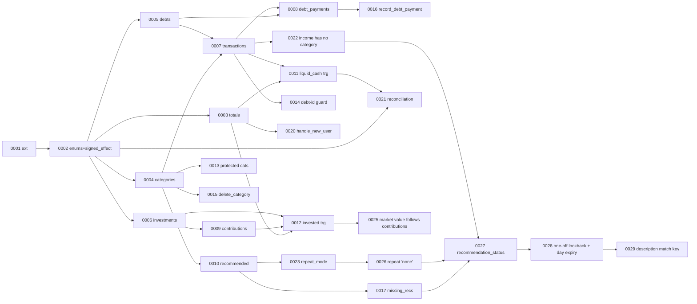

# Budget Manager — Implementation Specification

**Companion to:** `docs/ARCHITECTURE.md` (the source of truth; this document expands it, it does not override it).
**Audience:** A senior engineer who will build the app without making architectural decisions.
**Rule:** If this spec and the architecture ever disagree, the architecture wins — raise the conflict, do not silently diverge.
**Status:** Built through P7. Contracts below reflect migrations `0001–0029`; post-approval revisions are marked **Revised (NNNN)** and are catalogued in architecture **§21**.

No application code appears here. Schema, triggers, RPCs, and components are specified as contracts and pseudocode.

---

## 0. How to read this document

- **Contracts are normative.** Field names, enum values, error codes, and query keys are exact and must be used verbatim.
- **Pseudocode is illustrative** of behavior, not the implementation.
- **"MUST / SHOULD / MAY"** follow RFC 2119 sense.
- Money is always **integer centavos** in code and DB; pesos exist only at the display edge.

---

## 1. Complete Implementation Order

### 1.1 Phase order (hard sequence — do not parallelize across phases)

| # | Phase | Depends on | Exit gate |
|---|-------|-----------|-----------|
| P0 | Foundations (repo, tooling, Supabase project, PWA shell, auth login) | — | CP-0 |
| P1 | Schema & integrity core (all tables, RLS, seed, totals triggers) | P0 | CP-1 |
| P2 | Transactions CRUD + dashboard | P1 | CP-2 |
| P3 | Categories (CRUD + delete_category RPC) | P2 | CP-3 |
| P4 | Debts (CRUD + record_debt_payment RPC + EntryForm debt branch) | P3 | CP-4 |
| P5 | Investments (vehicles, contributions, market value, interest) | P2 (P3 optional) | CP-5 |
| P6 | Views polish + Recommended items | P2–P5 | CP-6 |
| P7 | Hardening (headers, CORS, scans, reconciliation, a11y, coverage) | P2–P6 | CP-7 |

> P5 depends only on P2 for the totals/trigger pattern; it may begin once P2 is merged even if P3/P4 are in flight, but it MUST NOT merge before P1.

### 1.2 Database migration order (each is a separate, forward-only migration file)

Migrations are numbered `NNNN_description.sql`. Apply strictly in order.

1. `0001_extensions` — enable `pgcrypto`/`uuid-ossp` (for `gen_random_uuid`), `pg_trgm` (optional, future search). No app tables.
2. `0002_enums_and_helpers` — enum-like CHECK domains or Postgres enums for `tx_type` (`expense|income`), `recurrence` (`recurrent|variable`), `category_kind` (`normal|otros|debt`), `debt_status` (`active|paid|archived`); shared immutable function `signed_effect(tx_type, integer) → bigint`. *(`recommend_repeat` (`monthly|yearly|none`) arrives later, in 0023/0026.)*
3. `0003_totals` — `totals` table + RLS.
4. `0004_categories` — `categories` table + RLS + partial unique indexes (one `otros`, one `debt` per user) + `UNIQUE(user_id, name)`.
5. `0005_debts` — `debts` table + RLS + CHECKs.
6. `0006_investments` — `investments` table + RLS + `UNIQUE(user_id, name)`.
7. `0007_transactions` — `transactions` table + RLS + FKs (`category_id` RESTRICT, `debt_id` nullable) + indexes.
8. `0008_debt_payments` — `debt_payments` table + RLS + FKs.
9. `0009_investment_contributions` — `investment_contributions` table + RLS + indexes.
10. `0010_recommended_items` — `recommended_items` table + RLS + CHECK window.
11. `0011_trigger_liquid_cash` — triggers on `transactions` (insert/update/delete) maintaining `totals.liquid_cash_cents`.
12. `0012_trigger_total_invested` — triggers on `investment_contributions` maintaining `totals.total_invested_cents` and `investments.contributed_total_cents`.
13. `0013_guard_protected_categories` — trigger blocking delete of `otros`/`debt` kinds (defense-in-depth behind the RPC).
14. `0014_guard_debt_id_requires_debt_category` — constraint trigger: `transactions.debt_id` may be non-null only when `category_id` is the user's `debt` category.
15. `0015_rpc_delete_category` — `delete_category(uuid)`.
16. `0016_rpc_record_debt_payment` — `record_debt_payment(uuid, integer, date, text)`.
17. `0017_rpc_missing_recommendations` — `missing_recommendations(integer month, integer year)`.
18. `0018_rpc_create_debt` — **never built.** The number is skipped; the client inserts debts directly. Do not reuse `0018`.
19. `0019_rpc_year_summary` — aggregate for the year view (built; not optional in practice — `/year` depends on it).
20. `0020_handle_new_user` — trigger on `auth.users` insert seeding `totals` (zeros), seed categories (11 + `debt`), seed investments (GBM, Cetes).
21. `0021_reconciliation_view` — read-only view/function asserting totals equal recomputed sums (uses the same `signed_effect`).

**Post-approval revisions** (architecture §21; each is forward-only like the rest):

22. `0022_income_has_no_category` — `transactions.category_id` nullable + `transactions_category_by_type` CHECK; backfills existing income rows to `NULL` (D11).
23. `0023_recommended_items_repeat` — `recommend_repeat` enum (`monthly|yearly`) + `recommended_items.repeat_mode` default `monthly` (D12).
24. `0024_rpc_missing_recommendations_repeat_income` — interim per-type matching. **Superseded by 0029**; kept for history.
25. `0025_market_value_follows_contributions` — `trg_total_invested` also maintains `investments.market_value_cents` (clamped at 0) + `investments_market_value_nonneg` CHECK (D1).
26. `0026_recommend_repeat_none` — adds `'none'` to `recommend_repeat`. **Alone in its own migration**: Postgres forbids *using* a new enum value in the transaction that adds it, and 0027 compares against it.
27. `0027_rpc_recommendation_status` — `recommendation_status(month, year)`; `missing_recommendations` rewritten as a wrapper over it.
28. `0028_rpc_recommendation_status_v2` — one-off lookback to `window_start`, day-granular expiry, `covered_on` (D13, D14). Drops/recreates the function: the return type gains a column, so `create or replace` cannot be used.
29. `0029_recommendations_match_on_description` — description becomes the match key for both types; category organisational; non-blank description CHECK (D3).

**Dependency notes:**
- `signed_effect` (0002) MUST exist before both the triggers (0011) and the reconciliation view (0021) — they share it.
- `totals` (0003) MUST exist before 0011/0012 and before `handle_new_user` (0020).
- `categories` (0004) MUST exist before `transactions` (0007), the debt-id guard (0014), and `delete_category` (0015).
- `debts` (0005) before `debt_payments` (0008) and `record_debt_payment` (0016).
- Seeding (0020) is last among schema so every referenced object exists.

### 1.3 Backend (Supabase) development order

1. Local Supabase (`supabase start`); apply migrations 0001–0010 (schema + RLS).
2. Prove RLS with a throwaway second user (must see zero cross-user rows).
3. Migrations 0011–0014 (triggers/guards) + pgTAP for each.
4. Migrations 0015–0019 (RPCs) + pgTAP for each.
5. Migration 0020 (seed) + verify a freshly created user is fully provisioned.
6. Migration 0021 (reconciliation) + a pgTAP test that drift is detectable.
7. Generate TypeScript types from the DB schema; commit them.

### 1.4 Frontend development order

1. App shell: providers (React Query, Supabase client, router), `AppLayout`, protected-route wrapper, `Login`.
2. Domain foundation: `money.ts`, `schemas.ts` (Zod), `types.ts` (generated), query-key registry.
3. `api/` wrappers per resource (thin, typed).
4. `Dashboard` (read-only totals) — proves the read path end to end.
5. `EntryForm` + `MonthView` (transactions CRUD).
6. `Categories` page (after `delete_category` RPC exists).
7. `Debts` page + EntryForm debt branch (after `record_debt_payment` RPC exists).
8. `Investments` page (contributions + market value + interest).
9. `YearView`.
10. `Recommended` page + `RecommendationBanner`.
11. Hardening pass (headers via host config, a11y, error/empty/loading states audit).

---

## 2. Database Implementation

RLS policy pattern for **every** table (unless noted): enable RLS; policies `select/insert/update/delete` with `USING (auth.uid() = user_id)` and, for insert/update, `WITH CHECK (auth.uid() = user_id)`. `user_id` default `auth.uid()`, `NOT NULL`.

Types: `id uuid PK default gen_random_uuid()`. Timestamps `timestamptz default now()`. Money line items `integer`, denormalized totals `bigint`.

### 2.1 `totals`

| Column | Type | Constraints |
|--------|------|-------------|
| user_id | uuid | PK, FK → auth.users(id) ON DELETE CASCADE |
| liquid_cash_cents | bigint | NOT NULL default 0 |
| total_invested_cents | bigint | NOT NULL default 0 |
| updated_at | timestamptz | NOT NULL default now() |

One row per user. `totalInterestMoney` is **not** stored (derived). No index beyond PK.

### 2.2 `categories`

| Column | Type | Constraints |
|--------|------|-------------|
| id | uuid | PK |
| user_id | uuid | NOT NULL, FK → auth.users, default auth.uid() |
| name | text | NOT NULL, length 1–64 (CHECK) |
| kind | category_kind | NOT NULL default `normal` |
| created_at | timestamptz | NOT NULL default now() |

Constraints/indexes:
- `UNIQUE(user_id, name)` (collision rejection, create + rename).
- Partial unique `UNIQUE(user_id) WHERE kind='otros'`.
- Partial unique `UNIQUE(user_id) WHERE kind='debt'`.

### 2.3 `debts`

| Column | Type | Constraints |
|--------|------|-------------|
| id | uuid | PK |
| user_id | uuid | NOT NULL, FK, default auth.uid() |
| name | text | NOT NULL, length 1–120 |
| total_months | integer | NOT NULL, CHECK > 0 |
| remaining_months | integer | NOT NULL, CHECK BETWEEN 0 AND total_months |
| minimum_payment_cents | integer | NOT NULL, CHECK > 0 |
| due_day | smallint | NOT NULL, CHECK BETWEEN 1 AND 31 |
| start_date | date | NOT NULL |
| status | debt_status | NOT NULL default `active` |
| created_at | timestamptz | NOT NULL default now() |

Index: `(user_id, status)`.

### 2.4 `investments`

| Column | Type | Constraints |
|--------|------|-------------|
| id | uuid | PK |
| user_id | uuid | NOT NULL, FK, default auth.uid() |
| name | text | NOT NULL, length 1–80 |
| contributed_total_cents | bigint | NOT NULL default 0 (trigger-maintained; app MUST NOT write) |
| market_value_cents | bigint | NOT NULL default 0, CHECK `>= 0`. **Revised (0025):** trigger-maintained **and** client-writable — see below |
| created_at | timestamptz | NOT NULL default now() |

Constraints: `UNIQUE(user_id, name)`; `investments_market_value_nonneg CHECK (market_value_cents >= 0)`.

`market_value_cents` is the sole column both the trigger and the client may write: the trigger adds each contribution's delta (0025), the client sets an absolute value for real gains/losses. The two compose because one is additive and the other absolute. Decrementing trigger paths clamp with `greatest(0, …)`, so the trigger can never trip the CHECK — the CHECK exists to reject direct client writes.

### 2.5 `transactions`

| Column | Type | Constraints |
|--------|------|-------------|
| id | uuid | PK |
| user_id | uuid | NOT NULL, FK, default auth.uid() |
| type | tx_type | NOT NULL |
| amount_cents | integer | NOT NULL, CHECK > 0 |
| tx_date | date | NOT NULL |
| description | text | NOT NULL default '', length 0–280 |
| category_id | uuid | **NULL allowed (0022)**, FK → categories(id) ON DELETE RESTRICT |
| recurrence | recurrence | NOT NULL default `variable` |
| debt_id | uuid | NULL, FK → debts(id) ON DELETE RESTRICT |
| created_at | timestamptz | NOT NULL default now() |
| updated_at | timestamptz | NOT NULL default now() |

Indexes: `(user_id, tx_date)`, `(user_id, category_id)`, `(user_id, type, tx_date)`, `(user_id, debt_id) WHERE debt_id IS NOT NULL`.

**Revised (0022) — `transactions_category_by_type` CHECK (D11):**
```
(type = 'income'  AND category_id IS NULL) OR
(type = 'expense' AND category_id IS NOT NULL)
```
Both halves are enforced deliberately. A one-sided rule would let a type flip strand a category; with both, `UPDATE … SET type='income'` alone is rejected — the statement MUST clear or set `category_id` at the same time. `EntryForm` submits the whole payload, so it satisfies this naturally.

Guard trigger (0014): `debt_id` non-null allowed only when `category_id = user's debt category`. Unaffected by 0022 — debt payments are always expenses and always carry the debt category.

### 2.6 `debt_payments`

| Column | Type | Constraints |
|--------|------|-------------|
| id | uuid | PK |
| user_id | uuid | NOT NULL, FK, default auth.uid() |
| debt_id | uuid | NOT NULL, FK → debts(id) ON DELETE RESTRICT |
| transaction_id | uuid | NOT NULL, FK → transactions(id) ON DELETE CASCADE |
| amount_cents | integer | NOT NULL, CHECK > 0 |
| payment_date | date | NOT NULL |
| covered_minimum | boolean | NOT NULL |
| months_decremented | smallint | NOT NULL default 0, CHECK IN (0,1) |
| created_at | timestamptz | NOT NULL default now() |

Index: `(user_id, debt_id, payment_date)`.

### 2.7 `investment_contributions`

| Column | Type | Constraints |
|--------|------|-------------|
| id | uuid | PK |
| user_id | uuid | NOT NULL, FK, default auth.uid() |
| investment_id | uuid | NOT NULL, FK → investments(id) ON DELETE RESTRICT |
| amount_cents | integer | NOT NULL, CHECK > 0 |
| contrib_date | date | NOT NULL |
| created_at | timestamptz | NOT NULL default now() |

Indexes: `(user_id, contrib_date)`, `(user_id, investment_id)`.

### 2.8 `recommended_items`

| Column | Type | Constraints |
|--------|------|-------------|
| id | uuid | PK |
| user_id | uuid | NOT NULL, FK, default auth.uid() |
| type | tx_type | NOT NULL |
| category_id | uuid | NULL, FK → categories(id) ON DELETE SET NULL (reassigned to Otros by RPC before delete). **Revised (0029): organisational only — plays no part in matching.** Always NULL for income (D11). |
| description | text | NOT NULL, **CHECK `char_length(btrim(description)) BETWEEN 1 AND 280` (0029)** — this is the match key |
| expected_amount_cents | integer | NULL, CHECK (NULL OR > 0) |
| window_start | date | NOT NULL |
| window_end | date | NULL, CHECK (window_end IS NULL OR window_end >= window_start). MUST be NULL when `repeat_mode='none'` |
| repeat_mode | recommend_repeat | **NOT NULL default `monthly` (0023/0026)** — `monthly` / `yearly` / `none` |
| created_at | timestamptz | NOT NULL default now() |

Index: `(user_id, type, category_id)`.

The description CHECK is not cosmetic: since 0029 the description is the *only* match key, so a blank one is an item that can never be covered and would be recommended forever. Zod rejects it at the boundary; the CHECK is the backstop (§13 of the architecture).

The window is the item's **lifetime**, not the days of the month it is due. Matching is month-granular, so the *day* of `window_start`/`window_end` never affects a repeating item — only expiry (D14) is day-granular. UI labels MUST NOT imply otherwise.

### 2.9 Shared function `signed_effect`

`signed_effect(p_type tx_type, p_amount integer) → bigint`: returns `+p_amount` when `income`, `-p_amount` when `expense`. `IMMUTABLE`. Used by triggers **and** reconciliation (single source of truth).

### 2.10 Triggers

**`liquid_cash` (on `transactions`, AFTER, per row):**
```
INSERT: totals.liquid_cash_cents += signed_effect(NEW.type, NEW.amount_cents)
DELETE: totals.liquid_cash_cents -= signed_effect(OLD.type, OLD.amount_cents)
UPDATE: totals.liquid_cash_cents += signed_effect(NEW...) - signed_effect(OLD...)
        AND set NEW.updated_at = now() (via BEFORE UPDATE, separate)
All scoped to the row's user_id; bump totals.updated_at.
```

**`total_invested` (on `investment_contributions`, AFTER, per row):** **Revised (0025)** — every branch that moves `contributed_total_cents` moves `market_value_cents` by the same delta (D1).
```
INSERT: totals.total_invested_cents += NEW.amount_cents;
        investments (NEW.investment_id): contributed_total_cents += NEW.amount_cents
                                         market_value_cents      += NEW.amount_cents
DELETE: subtract OLD.amount_cents from all three
        (market_value_cents floors at 0: greatest(0, market_value_cents - OLD.amount_cents))
UPDATE: apply delta to all three; if investment_id changed, move the delta between vehicles
        (debit the source, credit the destination — market value follows both sides)
```
The market-value mirror keeps `totalInterestMoney = market − invested` **flat across a contribution**. Without it, contributing raised `invested` while `market` stayed put, reporting a loss equal to the contribution.

**`protected_categories` (on `categories`, BEFORE DELETE):** raise `cannot_delete_protected_category` when `OLD.kind IN ('otros','debt')`.

**`debt_id_requires_debt_category` (on `transactions`, constraint trigger, AFTER INSERT/UPDATE):** raise `debt_id_requires_debt_category` when `debt_id IS NOT NULL` and `category_id` is not the user's debt category.

### 2.11 RPC functions (behavior; all `SECURITY INVOKER`, run under caller RLS)

Specified as contracts in §3.

### 2.12 Migration dependency graph



**Revision dependency notes:**
- `0026` (enum value `'none'`) MUST be its own migration and MUST precede any function that compares against it — Postgres forbids using a new enum value in the transaction that adds it.
- `0027`→`0028`→`0029` each **drop and recreate** `recommendation_status` when its return columns change; `create or replace` cannot alter a function's return type. `missing_recommendations` selects from it by column name via a string-bodied SQL function, so it carries no hard dependency and needs no change.
- `0029` depends on `0022`: description-only matching is what makes a category-less income item coverable at all.

---

## 3. API Contracts

**Transport:** `@supabase/supabase-js`. Direct table ops go through PostgREST (RLS-guarded); multi-step ops through `rpc()`. **Authorization for every operation:** a valid authenticated session; RLS restricts rows to `auth.uid()`. Unauthenticated calls fail with PostgREST 401.

Money fields are integer centavos. Dates are ISO `YYYY-MM-DD` strings.

### 3.1 Direct table operations

For each resource, standard `select/insert/update/delete`. Client-side Zod validation MUST pass before any write; DB constraints are the backstop.

| Resource | Writable by client | Notes |
|----------|--------------------|-------|
| `transactions` | insert/update/delete (non-debt) | Debt-category entries go through `record_debt_payment`, NOT direct insert. `category_id` MUST be `null` for income and set for expense (0022). |
| `categories` | insert/update (rename) | Delete via `delete_category` RPC only. |
| `debts` | insert/update (incl. `remaining_months`, `status='archived'`) | Hard delete disallowed by convention; UI only archives. |
| `investments` | insert/update (incl. `market_value_cents`)/delete | MUST NOT write `contributed_total_cents`. `market_value_cents` IS client-writable (absolute value) even though the trigger also adds contribution deltas to it (0025) — the two compose; writes must be `>= 0`. |
| `investment_contributions` | insert/update/delete | Triggers keep totals correct. |
| `recommended_items` | insert/update/delete | — |
| `totals` | select only | Client never writes. |

**Common error surface (PostgREST/Postgres):**

| Condition | Error |
|-----------|-------|
| No session | 401 Unauthorized |
| RLS blocks row | 403 / empty result |
| CHECK/enum violation | 400 with Postgres code `23514`/`22P02` |
| Unique violation (`categories.name`, `investments.name`) | 409, code `23505` → map to "name already exists" |
| FK RESTRICT (delete used category directly) | 409, code `23503` → instruct to use RPC |

### 3.2 RPC: `record_debt_payment`

- **Authorization:** session required; RPC resolves debt under caller RLS.
- **Request:** `{ debt_id: uuid, amount_cents: integer, date: 'YYYY-MM-DD', description: string }`
- **Validation:**
  - `debt_id` references an `active` debt owned by the user → else `debt_not_found`.
  - `amount_cents` integer > 0 → else `invalid_amount`.
  - `date` valid date (past/future allowed).
  - `description` length 0–280.
- **Behavior (one transaction):** insert an `expense` transaction (category = user's debt category, `debt_id` set, `recurrence='recurrent'` by default, given date/description/amount) → liquid_cash trigger fires; insert `debt_payments` row linking the transaction; `covered = amount_cents >= minimum_payment_cents`; if `covered AND remaining_months > 0` then `remaining_months -= 1` and set `status='paid'` when it reaches 0; `months_decremented` recorded (0 or 1).
- **Response:** `{ transaction: Transaction, debt: Debt, covered_minimum: boolean, months_decremented: 0|1 }`
- **Errors:** `debt_not_found`, `invalid_amount`, `debt_not_active`.

### 3.3 RPC: `delete_category`

- **Authorization:** session; resolves user's Otros category.
- **Request:** `{ category_id: uuid }`
- **Validation:** category exists & owned → else `category_not_found`; `kind NOT IN ('otros','debt')` → else `cannot_delete_protected_category`.
- **Behavior (one transaction):** reassign `transactions` and `recommended_items` from `category_id` to Otros; delete the category. Amounts untouched → `liquid_cash` unchanged.
- **Response:** `{ deleted_id: uuid, reassigned_transactions: integer, reassigned_recommendations: integer }`
- **Errors:** `category_not_found`, `cannot_delete_protected_category`.

### 3.4 RPCs: `recommendation_status` and `missing_recommendations`

**Revised (0027/0028/0029).** `recommendation_status` is the single source of truth for matching; `missing_recommendations` is a thin wrapper over it, so the dashboard banner and the `/recommended` page can never disagree about the same period. Do not reimplement the match anywhere else.

#### `recommendation_status`

- **Request:** `{ month: 1..12, year: integer }`
- **Validation:** `month` in 1–12, `year` in 2000–2100 → else `invalid_period`.
- **Response:** `Array<{ item: RecommendedItem, is_covered: boolean, is_due: boolean, is_expired: boolean, covered_on: 'YYYY-MM-DD' | null }>` — **one row per item**, not only the due ones.
- **Behavior**, per item, for the period in America/Mexico_City:

  | Field | Rule |
  |-------|------|
  | *match key* | Same `type` **and** `lower(btrim(t.description)) = lower(btrim(ri.description))`. Exact after trim/case-fold — **not** a substring. Category is irrelevant (D3). |
  | *coverage range* | `repeat_mode='none'` → `[window_start, month_end]` (ever paid since it started, D13). Otherwise → `[month_start, month_end]` (this period only). |
  | `covered_on` | `min(tx_date)` of matching transactions in range; `NULL` when none. |
  | `is_covered` | `covered_on IS NOT NULL`. |
  | `is_expired` | `window_end IS NOT NULL AND window_end < ref`, where `ref` = today if the queried period is the current month, else `month_start` (D14). |
  | *scheduled* | `monthly`/`none` → always; `yearly` → `extract(month from window_start) = p_month`. |
  | `is_due` | `window_start <= month_end` **AND** `NOT is_expired` **AND** *scheduled* **AND** `NOT is_covered`. |

- **Errors:** `invalid_period`.

> **The three flags are independent — never derive one from another.** In particular `is_covered` is NOT "absent from `missing_recommendations`": that list also omits items which are merely not *due*. A `yearly` item anchored to March is absent 11 months a year; treating absence as coverage files it as "past" for those 11 months (D15). Consumers splitting pending/past MUST read `is_expired`/`is_covered` directly.

#### `missing_recommendations`

- **Request / errors:** as above (the guard lives in `recommendation_status` and propagates).
- **Behavior:** `select item from recommendation_status(month, year) where is_due`.
- **Response:** `Array<{ item: RecommendedItem }>` — unchanged contract, so the banner was untouched by the revisions.

### 3.5 RPC: `create_debt` (optional wrapper) — **NOT BUILT**

Never implemented; there is no `0018` migration. `DebtForm` inserts into `debts` directly and seeds `remaining_months = total_months` itself, with Zod enforcing the validation below and the table CHECKs as backstop. Retained here because §4.6 cites it for the field rules.

- **Would-be request:** `{ name, total_months, minimum_payment_cents, due_day, start_date }`
- **Validation (enforced today by Zod + CHECKs):** name 1–120; `total_months>0`; `minimum_payment_cents>0`; `due_day` 1–31; valid `start_date`.

### 3.6 RPC: `year_summary` (optional)

- **Request:** `{ year: integer }`
- **Response:** `Array<{ month: 1..12, income_cents, expense_cents, balance_cents, invested_cents }>` (12 rows, zero-filled).
- **Errors:** `invalid_period`.

### 3.7 Error contract (client mapping)

All RPC errors surface as Postgres exceptions with a stable machine code in the message. The `api/` layer maps each code → a typed `AppError { code, userMessage }`. Unknown codes → generic `unexpected_error`. Never surface raw Postgres text to users.

---

## 4. Frontend Specification (per page)

Global states convention: **loading** = skeletons (never layout shift), **empty** = illustration + primary CTA, **error** = inline retry with mapped message, **offline** = banner "Sin conexión — se requiere internet".

### 4.1 `/login`

- **Purpose:** authenticate the single admin-provisioned user.
- **Components:** `LoginForm` (email, password), submit button, error alert.
- **Flow:** submit → supabase sign-in → on success redirect to `/`; on failure show mapped error. No signup/reset links (D8).
- **Loading:** button spinner, inputs disabled.
- **Empty:** n/a.
- **Validation:** email format, password non-empty (Zod).
- **Errors:** `invalid_credentials` → "Correo o contraseña incorrectos"; network → offline banner.

### 4.2 `/` Dashboard

- **Purpose:** at-a-glance financial position.
- **Components:** `LiquidCashCard`, `InvestedSummaryCard` (market value headline + total invested + interest amount/%, per-vehicle rows), `PendingDebtsList` (current month), `QuickAddButton` (opens `EntryForm` modal), `MonthPicker` (drives pending debts + recommendation banner), `RecommendationBanner`.
- **Flow:** loads `totals` + `investments` + pending debts + `missing_recommendations(currentMonth, year)`.
- **`RecommendationBanner` → "Completada" (FR-27, D16):** writes a plain transaction via the ordinary create mutation — **not** an RPC; one insert needs no atomicity guarantee. Payload is derived wholly from the item:

  | Field | Value |
  |-------|-------|
  | `type` | the item's |
  | `amount_cents` | `expected_amount_cents` |
  | `tx_date` | today (MX) |
  | `description` | the item's, **verbatim** — it is the match key, so this is what clears the item (D3) |
  | `category_id` | income → `null`; expense → the item's category, else **Otros** (an expense MUST have one, D11) |
  | `recurrence` | `variable` when `repeat_mode='none'`, else `recurrent` |

  **MUST NOT invent an amount.** When `expected_amount_cents IS NULL`, open `EntryForm` with a `prefill` (type, description, resolved category) so the user supplies the amount. The create mutation invalidates `['recommendations']`, so the banner row disappears on success.
- **Loading:** card skeletons.
- **Empty:** fresh account shows zeros + "Agrega tu primer movimiento" CTA.
- **Validation:** market-value inline edit → integer ≥ 0.
- **Errors:** per-card retry; interest hidden (not zero) when `total_invested_cents = 0`, with tooltip "Sin inversiones aún".

### 4.3 `/month` MonthView

- **Purpose:** monthly expenses & incomes in **separate tables** + period totals.
- **Components:** `MonthPicker`, `PeriodTotalsBar` (income, expense, balance, invested-this-month), `TransactionTable` (income), `TransactionTable` (expense) with `recurrence` badge and, for debt rows, a `DebtBadge` naming the debt (FR-12), row actions (edit/delete), `RecurrenceFilter`, `CategoryFilter`.
- **Flow:** pick month → fetch transactions in `[monthStart, monthEnd]`; edit/delete inline (delete confirms). Both filters are applied **client-side** over the fetched rows — no extra query, no new query key; personal scale makes a round-trip pointless.
- **`CategoryFilter` (FR-11, D17):** `'all'` (the `ALL_CATEGORIES` sentinel — Radix forbids an empty item value) or a category id. Selecting a category:
  - narrows the **expense** table to that `category_id`;
  - **hides the income table** — income has no category (D11), so it can never match;
  - passes `expensesOnly` to `PeriodTotalsBar`, which then renders only *Gastos (categoría)* and *Invertido*, dropping *Ingresos* and *Balance*.

  Dropping those two tiles is deliberate, not laziness: a `$0` income beside a filtered expense total would make *Balance* read as full-income − filtered-expense — a number that means nothing — and would break **AC-Month/Year views** (*totals equal the sum of displayed rows*). *Invertido* survives because it is an independent month aggregate that no table filter touches. A `role="status"` line states the exclusion in plain Spanish.
- **Loading:** table skeleton rows.
- **Empty:** per table "Sin movimientos este mes".
- **Validation:** edit reuses `EntryForm` schema.
- **Errors:** mapped; failed delete keeps the row.

### 4.4 `/year` YearView

- **Purpose:** 12-month overview.
- **Components:** `YearPicker`, `YearSummaryTable` (per-month income/expense/balance/invested), totals footer.
- **Flow:** pick year → `year_summary(year)`.
- **Empty:** all-zero rows still render (structure visible).

### 4.5 `/categories`

- **Purpose:** manage categories.
- **Components:** `CategoryList` (Otros & debt shown locked), `CategoryForm` (add/rename), delete action (confirm dialog warning "Los movimientos pasarán a Otros").
- **Flow:** add/rename via table ops; delete via `delete_category` RPC → toast with reassigned counts.
- **Validation:** name 1–64, unique (client pre-check + handle 409).
- **Errors:** `cannot_delete_protected_category` (buttons disabled anyway), name collision.

### 4.6 `/debts`

- **Purpose:** manage debts and view progress.
- **Components:** `DebtList` (active/paid/archived filter), `DebtForm` (create/edit incl. `remaining_months` manual override), `DebtProgress` (remaining/total months, due day), `RecordPaymentButton` → `PaymentDialog`, archive action.
- **Flow:** create via `create_debt` (or insert); record payment via `record_debt_payment` (prefills minimum) with **duplicate-payment warning** if a covering payment exists this month; archive sets `status='archived'`.
- **Validation:** debt fields per §3.5; `remaining_months` 0–total_months.
- **Errors:** `debt_not_active`, `invalid_amount`.

### 4.7 `/investments`

- **Purpose:** manage vehicles, contributions, and market value.
- **Components:** `InvestmentList` (name, contributed_total, market_value editable, interest per vehicle), `InvestmentForm` (add/rename/delete vehicle), `ContributionForm` (vehicle + amount + date), `ContributionHistory`.
- **Flow:** add contribution → invested totals update (invalidate totals + investments); edit market value inline.
- **Validation:** vehicle name 1–80 unique; contribution amount > 0; market value ≥ 0.
- **Errors:** name collision (409), amount invalid.

### 4.8 `/recommended`

- **Purpose:** manage recommendation templates and show their state this month.
- **Components:** `RecommendedList` ×2 (**Pendientes**, **Ya registradas o vencidas**), `RecommendedForm` (type, repeat mode, category, description, expected amount optional, window_start, window_end optional).
- **Flow:** reads `recommendation_status(currentMonth, currentYear)` — "this month" is literal; the page has no period picker. Splits on `is_expired || is_covered` → past, else pending (D15). `RecommendedList` takes the **status rows**, not bare items, so it can render Estado.
- **Estado column:** `Registrada el <covered_on>` when covered (coverage wins over expiry — *when* it was registered is more useful than that the window has since closed), else `Vencida` when expired, else `Pendiente`.
- **Window/repeat labels (FR-24):** the day is dropped where matching ignores it — `Cada mes` → "Desde jun 2026"; `Cada año` → "junio · 2026 – 2027" (month is the anchor); `Una vez` → "14 jun 2026" (full date; the day is real). Lives in `domain/recommendations.ts` (`repeatLabel`, `windowLabel`) so it is unit-testable.
- **Form behaviour:** a new item **defaults to `repeat_mode='none'`** (a one-off). This is a *form* default only — `recommended_items.repeat_mode` keeps its `monthly` column default, which is the backward-compatible value for rows written before the column existed and for any writer that omits it. `repeat_mode='none'` hides the window-end field, relabels the start to "Fecha", and submits `window_end: null`. Category is hidden for income (D11) and labelled "sólo para organizar" for expenses, since it does not drive matching (D3).
- **Validation:** description **required** (non-blank) for both types — it is the match key; window_end ≥ window_start (skipped when `none`, whose end is ignored); expected amount > 0 if present.

### 4.9 `EntryForm` (shared modal component)

- **Purpose:** create/edit a transaction.
- **Fields:** type (default expense), amount (pesos input → centavos), tx_date (default today), description, category (dropdown, **expenses only**), recurrence (default variable). When category resolves to **debt kind**: replace amount with a `DebtSelect`, prefill amount = minimum payment, and on submit call `record_debt_payment` instead of a plain insert; show duplicate-payment warning.
- **Income (D11):** selecting `income` hides the category field, clears any value already chosen, and submits `category_id: null`. Clearing on switch is required, not cosmetic — a retained value would violate `transactions_category_by_type`.
- **`prefill?: EntryPrefill` (new-entry only, ignored on edit):** seeds `type` / `amountPesos` / `description` / `category_id`. Used by the banner when a recommendation has no expected amount, so the user supplies only the unknown field.
- **"Desde una recomendación…" (FR-28, D16):** a sentinel row at the top of the category dropdown, shown only when creating and only when pending expense items exist. It mirrors the debt branch, but a recommendation is **not** a category — so unlike the debt flow (which selects the real `debt` category) the sentinel MUST NOT reach `category_id`, which is a uuid. Hold it in local state instead; picking a pending item copies `description` and `expected_amount_cents`, sets `category_id` to that item's own category (Otros when it has none), then clears the sentinel so the dropdown shows the category that will actually be saved. Reachable for expenses only — the category field is hidden for income. Reads `useMissingRecommendations(currentMonth, year)`, i.e. exactly the due items, filtered to `type='expense'`.
- **Validation (Zod):** amount > 0 integer centavos after conversion; date valid; description ≤ 280; category **required for expense, forbidden for income** (mirrors the CHECK on both halves, so the form cannot submit a payload the DB will reject).
- **States:** submitting spinner; success closes modal + toast + invalidations (§6); error inline.

---

## 5. Component Hierarchy

```
<AppProviders>              # QueryClientProvider, SupabaseProvider, Router
└── <AppLayout>             # nav, offline banner, toaster
    ├── <ProtectedRoute>
    │   ├── <Dashboard>
    │   │   ├── <LiquidCashCard>
    │   │   ├── <InvestedSummaryCard>
    │   │   ├── <PendingDebtsList>
    │   │   ├── <RecommendationBanner>
    │   │   └── <QuickAddButton> → <EntryForm/>
    │   ├── <MonthView>
    │   │   ├── <MonthPicker>
    │   │   ├── <PeriodTotalsBar>          # expensesOnly while a category is picked
    │   │   ├── <CategoryFilter> + <RecurrenceFilter>
    │   │   ├── <TransactionTable kind="income">   # hidden while a category is picked
    │   │   └── <TransactionTable kind="expense"> (DebtBadge, RecurrenceBadge)
    │   ├── <YearView> → <YearPicker> + <YearSummaryTable>
    │   ├── <Categories> → <CategoryList> + <CategoryForm> + <ConfirmDialog>
    │   ├── <Debts> → <DebtList> + <DebtForm> + <DebtProgress> + <PaymentDialog>
    │   ├── <Investments> → <InvestmentList> + <InvestmentForm> + <ContributionForm> + <ContributionHistory>
    │   └── <Recommended> → <RecommendedList> + <RecommendedForm>
    └── <Login> (public) → <LoginForm>
Shared primitives: <EntryForm>, <DebtSelect>, <MoneyInput>, <DatePicker>,
                   <ConfirmDialog>, <Skeleton>, <EmptyState>, <ErrorState>, <Toast>
```

`api/` and `hooks/` are non-visual layers consumed by pages; no page imports `supabase-js` directly.

---

## 6. State Management

### 6.1 React Query (server state) — query-key registry (exact)

| Key | Source | Invalidated by |
|-----|--------|----------------|
| `['totals']` | `totals` row | any transaction/contribution mutation, debt payment, market-value edit* |
| `['investments']` | `investments` list | contribution mutations, vehicle CRUD, market-value edit |
| `['transactions', { year, month }]` | month range | transaction mutations, debt payment in that month |
| `['transactions','year', year]` / `['yearSummary', year]` | aggregate | any transaction mutation in that year |
| `['categories']` | categories | category CRUD, `delete_category` |
| `['debts', { status }]` | debts | debt CRUD, `record_debt_payment`, archive |
| `['debtPayments', debtId]` | payments | `record_debt_payment` |
| `['contributions', { investmentId }]` | contributions | contribution CRUD |
| `['recommendations', { year, month }]` | `missing_recommendations` RPC | transaction mutations in that period, recommended-item CRUD |
| `['recommendations','status', { year, month }]` | `recommendation_status` RPC | as above — **nested under the `['recommendations']` prefix on purpose**, so existing prefix invalidation covers it. Coverage depends on transactions, so a transaction mutation MUST refetch it. |

\* market-value edit invalidates `['investments']`; `['totals']` need not refetch for market value (interest is computed client-side from investments), but the dashboard MUST recompute interest from the fresh investments list.

**Mutation → invalidation matrix (authoritative):**

| Mutation | Invalidate |
|----------|-----------|
| create/update/delete transaction | `['totals']`, `['transactions', period]`, `['yearSummary', year]`, `['recommendations', period]` |
| `record_debt_payment` | `['totals']`, `['transactions', period]`, `['debts', *]`, `['debtPayments', debtId]`, `['yearSummary', year]`, `['recommendations', period]` |
| create/update/delete contribution | `['totals']`, `['investments']`, `['contributions', {investmentId}]` — note `['investments']` now also carries the changed `market_value_cents` (0025) |
| edit market_value | `['investments']` |
| category create/rename | `['categories']` |
| `delete_category` | `['categories']`, `['transactions', *]`, `['recommendations', *]` |
| debt create/edit/archive | `['debts', *]` |
| recommended item CRUD | `['recommendations', *]` |

**Policy:** prefer **invalidate-and-refetch** over optimistic cache edits for anything touching money totals (the true delta is server-side). Optimistic updates MAY be used for list-row add/remove UX but the totals card MUST reflect refetched values.

### 6.2 Zustand (client/UI state)

- `useUiStore`: `selectedMonth`, `selectedYear` (default now, MX tz), open-modal descriptor, active filters (recurrence). No server data.

### 6.3 Local component state

- Form field state via React Hook Form; ephemeral toggles (dialog open) local unless shared.

### 6.4 Cache/session

- Supabase session in httpOnly cookies (SDK-managed). React Query `staleTime` 30s default; `['totals']` `staleTime` 0 (always fresh after mutations). Refetch-on-window-focus enabled.

---

## 7. Testing Strategy (per feature)

Coverage gates: 80% overall, 90% new/modified, **95% financial-critical** (triggers, RPCs, money helpers, EntryForm submit path).

### 7.1 Money & domain helpers
- **Unit:** `toCentavos`/`formatMXN` round-trip; rejects NaN/Infinity/negative; `signed_effect` parity (TS mirror vs. DB via integration).

### 7.2 Totals integrity (P1) — **highest priority**
- **pgTAP:** insert income/expense adjusts `liquid_cash_cents` correctly; delete reverses; **update-by-delta** for amount change, type flip (expense↔income), and both; multiple rows accumulate; RLS prevents cross-user total mutation; reconciliation view reports zero drift after a randomized sequence and non-zero after a deliberately corrupted row.

### 7.3 Transactions (P2)
- **Integration (real test DB):** CRUD reflects in `totals`.
- **E2E (Playwright):** add expense → dashboard balance decreases by amount; edit → adjusts by delta; delete → reverses; month view shows row in correct table.
- **Unit:** EntryForm validation branches.

### 7.4 Categories (P3)
- **pgTAP:** `delete_category` reassigns transactions + recommended items to Otros atomically; rejects Otros/debt; name uniqueness enforced.
- **E2E:** delete used category → rows show Otros; totals unchanged.

### 7.5 Debts (P4)
- **pgTAP:** `record_debt_payment` creates expense + payment + decrements one month when covered; no decrement when below minimum; rollback on forced failure leaves totals and debt untouched; manual `remaining_months` edit bounded.
- **E2E:** record payment prefilled with minimum; duplicate-payment warning appears; balance decreases; remaining months drop by one; archive hides from active list but keeps history.

### 7.6 Investments (P5)
- **pgTAP:** contribution insert/delete/update maintains `total_invested_cents` and per-vehicle `contributed_total_cents`, including moving between vehicles; contributions do NOT change `liquid_cash_cents`. **Since 0025 also:** `market_value_cents` moves by the same delta on every branch; **a contribution leaves `market − invested` unchanged** (the regression guard — a phantom loss equal to the contribution); a manual market-value edit survives and a later contribution adds on top of it; a delete after a hand-lowered value floors at 0 rather than going negative; a direct negative write is rejected (`23514`).
- **E2E:** add contribution → invested total rises, liquid cash unchanged, market value rises, interest unchanged; edit market value → interest amount/% recompute; interest hidden when contributed = 0.

### 7.7 Recommendations (P6)
- **pgTAP:** window overlap respected; description match covers, and is trimmed/case-folded but **not** substring ("Luces de navidad" must not cover "Luz"); an expense in the *same* category with a *different* description does NOT cover; a matching description in a *different* category DOES cover; an income cannot cover an expense sharing its description; **two items under one category stay independent** (the reason for D3); repeat modes (`monthly`/`yearly`/`none`); `none` paid once stays covered in later months and does not re-nag, while a `monthly` item is NOT covered by a previous month's payment; a later payment does not retroactively cover an earlier month; `covered_on` reports the covering date; day-granular expiry (ends **today** → still pending; ended yesterday → expired) anchored to `current_date` so the test cannot rot; a historical query does not expire an item inside its own window; blank description rejected (`23514`); `missing_recommendations` equals exactly the `is_due` set.
- **The trap, pinned explicitly:** a `yearly` item outside its anniversary month must report `is_due=false, is_covered=false, is_expired=false` — i.e. it stays **pending**, not past. This is the assertion that stops anyone "simplifying" the split back to inferring coverage from absence.
- **Unit (RTL), the UI-only behaviours** — these have no migration, so tests are the only thing pinning them:
  - *Completada* builds the payload from the item (description verbatim, expected amount, today, `recurrent` vs `variable` by repeat mode); a category-less expense item resolves to **Otros**; an income item sends `category_id: null`; **an item with no expected amount creates nothing and opens the form** (the "invents nothing" guard).
  - The entry form's recommendation sentinel fills description/amount and resolves to the item's **own** category — the sentinel must never appear in a submitted payload; the option is absent when nothing is pending.
  - `PeriodTotalsBar` drops the *Ingresos*/*Balance* tiles under `expensesOnly` and keeps *Invertido* (D17).
  - `RecommendedForm` defaults to a one-off: no window-end field, submits `repeat_mode:'none', window_end:null`; switching to a repeating mode reveals the field.
- **E2E:** banner appears when expected item missing; disappears after adding a matching transaction, and after pressing Completada.

### 7.8 Auth & RLS (cross-cutting)
- **Integration:** unauthenticated calls 401; second user sees zero rows across all tables; RPCs run under caller RLS.

### 7.9 PWA/offline
- **E2E:** app installs; offline → data mutations show offline banner and do not corrupt state; shell still loads.

### 7.10 Mock policy
- Unit tests mock supabase-js via MSW at the network boundary. Integration/pgTAP use a real local Postgres. Never mock the code under test or DB in integration.

---

## 8. Acceptance Criteria (per feature, Given/When/Then)

- **AC-Transactions:** *Given* a balance of X, *when* I add an expense of Y, *then* the dashboard `liquidCash` reads X−Y and the row appears in the month's expense table. Edit adjusts by delta; delete reverses exactly.
- **AC-Category-delete:** *Given* category C with N transactions, *when* I delete C, *then* those N transactions show "Otros", C is gone, `liquidCash` is unchanged, and I cannot delete Otros or debt.
- **AC-Debt-payment:** *Given* an active debt with minimum M and R remaining months, *when* I record a payment ≥ M, *then* an expense of that amount is created, `liquidCash` decreases by it, remaining months = R−1 (or status `paid` at 0), and the month view labels the row with the debt; a payment < M creates the expense but does not decrement.
- **AC-Debt-duplicate:** *Given* a covering payment already this month, *when* I open the payment dialog, *then* a warning is shown but the payment is still allowed.
- **AC-Investment:** *Given* liquid cash L, *when* I add a contribution of A, *then* `totalInvested`, the vehicle's contributed total **and its market value** increase by A, `liquidCash` stays L, and **`totalInterestMoney` is unchanged** (a contribution is not a loss — D1). Editing market value updates `totalInterestMoney` = totalMarketValue − totalInvested and its %.
- **AC-Interest-zero:** *Given* zero contributions, *when* I view the dashboard, *then* interest % is not shown (no divide-by-zero) and a tooltip explains why.
- **AC-Income-no-category:** *Given* the entry form, *when* I select Ingreso, *then* the category field disappears and the saved row has `category_id = NULL`; the month view's income table has no category column; an expense still requires a category (D11).
- **AC-Recommendation:** *Given* a recommended item described "Agua" active this month with no matching transaction, *when* I open the month, *then* it is recommended; after I add a transaction described "Agua" (any category, any case/spacing) it disappears. A second item "Luz" under the same category is unaffected (D3).
- **AC-Recommendation-repeat:** *Given* a `yearly` item anchored to March, *when* I view July, *then* it is neither due nor covered nor expired and stays in **Pendientes** (D15). *Given* a `none` item paid in Aug 2025, *when* I view any later month, *then* it reads "Registrada el 14 ago 2025" in the past table and the banner does not re-nag (D13).
- **AC-Recommendation-expiry:** *Given* an item whose window ends today, *when* it is uncovered, *then* it is still **Pendiente**; the day after, it is **Vencida** (D14).
- **AC-Recommendation-complete:** *Given* a pending item with an expected amount, *when* I press **Completada**, *then* a movement is created with that amount, the item's description, today's date and the item's own category (Otros when it has none), `liquidCash` moves by it, and the banner row disappears. *Given* an item with **no** expected amount, *when* I press Completada, *then* **no movement is created** and the prefilled form opens for the amount (D16).
- **AC-Entry-from-recommendation:** *Given* a pending expense item, *when* I choose "Desde una recomendación…" and pick it, *then* the description and amount are filled and the category becomes the item's own — never the sentinel (FR-28).
- **AC-Category-filter:** *Given* a month with income and expenses, *when* I filter by a category, *then* only that category's expenses are listed, the income table is hidden, and the totals bar shows only *Gastos (categoría)* and *Invertido* — never a `$0` income or a balance (D17).
- **AC-Month/Year views:** period totals equal the sum of displayed rows; year view shows 12 rows zero-filled.
- **AC-Auth:** only the admin-provisioned user can sign in; there is no reset/signup UI; RLS blocks any cross-user read.
- **AC-Reconciliation:** the reconciliation check reports zero drift after any sequence of operations in the test suite.

---

## 9. Definition of Done (per phase)

A phase is done only when **all** hold:

**Every phase:** migrations apply cleanly forward on a fresh DB; TS types regenerated & committed; lint + typecheck clean; unit/integration/pgTAP/E2E for the phase pass; coverage gates met; no `service_role` in client bundle; PR reviewed; docs/handoff updated.

- **CP-0 done:** app installs as PWA (Lighthouse PWA pass), login works against a seeded user, protected routes redirect when logged out.
- **CP-1 done:** all tables + RLS live; totals triggers proven by pgTAP incl. delta/type-flip; reconciliation view exists and detects injected drift; second-user RLS test green.
- **CP-2 done:** transaction CRUD end-to-end; dashboard reads saved totals; money round-trips float-free; month view separates income/expense.
- **CP-3 done:** category CRUD; `delete_category` atomic reassign + protection + collision rejection proven.
- **CP-4 done:** `record_debt_payment` atomic (payment+decrement+rollback proven); EntryForm debt branch + duplicate warning; pending debts + month annotation.
- **CP-5 done:** contributions maintain invested totals without touching liquid cash; market value + interest amount/% correct; zero-contribution guard.
- **CP-6 done:** year view + `missing_recommendations` correct; recommendation banner behavior verified.
- **CP-7 done:** security headers + CORS allowlist configured at host; dependency scan clean (no critical/high); reconciliation monitor scheduled; a11y AA audit passes; all coverage gates green → **release candidate**.

---

## 10. Coding Standards

### 10.1 Folder conventions
Per architecture §16. One resource module per file in `api/` and `hooks/`. Co-locate a component's test as `Name.test.tsx`. Pure logic in `domain/`; no React imports there.

### 10.2 Naming
- Files: components `PascalCase.tsx`; hooks `useThing.ts`; api modules `resource.ts`; SQL migrations `NNNN_snake_case.sql`.
- DB: tables/columns `snake_case`, plural tables. Money columns end in `_cents`. Enums singular.
- TS: types/interfaces `PascalCase`; variables/functions `camelCase`; constants `UPPER_SNAKE`. Query keys from the central registry only — no inline literals.
- Error codes: `snake_case` machine codes, stable, mirrored between DB and the `api/` mapper.

### 10.3 TypeScript rules
`strict: true`, `noUncheckedIndexedAccess`, `exactOptionalPropertyTypes`. No `any` (use `unknown` + narrow). DB types are generated, never hand-edited. Money is a branded `Centavos` type where practical to prevent unit mix-ups. All API responses validated/narrowed before use.

### 10.4 ESLint rules
`@typescript-eslint/recommended-type-checked`, `eslint-plugin-react`, `react-hooks` (exhaustive-deps error), `import/order`, `no-floating-promises`, `@tanstack/eslint-plugin-query`. Ban direct `supabase` import outside `api/` (custom `no-restricted-imports`). Prettier for formatting; no style debates in review.

### 10.5 React best practices
Function components + hooks only. Server state exclusively via React Query hooks; never fetch in `useEffect`. Keep components presentational where possible; push data logic into hooks. Stable keys; no index keys on dynamic lists. Suspense/error boundaries at route level. Controlled inputs via RHF. Accessibility: label every input, manage focus in dialogs, honor reduced motion.

### 10.6 Supabase best practices
RLS on every table, always keyed to `auth.uid()`. RPCs `SECURITY INVOKER`. Never expose `service_role` to the client. Schema/RLS/functions live in versioned migrations (source of truth), not the dashboard. Regenerate types after every schema change. Client never writes trigger-maintained columns (`contributed_total_cents`) or `totals`. Handle PostgREST error codes explicitly; map to typed app errors. Use `.single()`/`.maybeSingle()` deliberately.

---

## 11. Implementation Risks (extra care)

| Area | Why risky | Guardrail |
|------|-----------|-----------|
| Totals triggers (update-by-delta, type flip) | Silent money corruption | Exhaustive pgTAP incl. type flip + reconciliation drift test; the ONLY writer of totals. |
| Shared `signed_effect` | Two copies would hide drift | Single DB function used by triggers AND reconciliation; assert parity in tests. |
| `record_debt_payment` atomicity | Partial failure desyncs cash vs. debt | Single RPC/transaction; rollback test with forced error. |
| Seeding order (`totals` before first tx) | Missing totals row → trigger no-op/error | `handle_new_user` seeds totals first; migration order pinned; test fresh-user provisioning. |
| Money unit mixups (pesos vs centavos) | Off-by-100 bugs | Branded `Centavos` type; conversion only in `MoneyInput`/`formatMXN`; property tests. |
| Timezone month boundaries & `due_day` clamp | Off-by-one at edges | `DATE`-only storage; fixed America/Mexico_City; tests for day 29–31 and month edges. **Never compare against `current_date`/`now()::date`** — the server runs UTC and MX is UTC-6, so they differ from 18:00 MX onward. Code derives `(now() at time zone 'America/Mexico_City')::date`; pgTAP uses the `pg_temp.mx_today()` helper in `09_missing_recommendations.test.sql`. Mixing the two produced a test that passed each morning and failed each evening. |
| Divide-by-zero in interest % | NaN/Infinity in UI | Guard when `total_invested_cents = 0`; hide %, show tooltip. |
| RLS gaps | Cross-user leakage (future multi-user) | Second-user test across every table in CI. |
| Direct debt-category insert bypassing RPC | Debt state desync | Constraint trigger + UI routes debt entries to RPC; test that a raw insert with debt_id+non-debt category is rejected. |
| Optimistic totals | Showing wrong balance | Policy: invalidate-and-refetch for money; no optimistic totals. |
| Service-role/secret leakage | Critical exposure | Pre-commit + CI secret scan; only anon key in bundle. |

---

## 12. Suggested Implementation Checkpoints

Small, reviewable stops (finer-grained than phases). Each checkpoint = a mergeable PR with its tests green.

- **CP-0.1** Repo + tooling (Vite, TS strict, ESLint, Prettier, Tailwind, shadcn, Vitest, Playwright) — CI runs empty suite.
- **CP-0.2** Supabase local + client provider + auth login + protected routes + PWA manifest/SW.
- **CP-1.1** Migrations 0001–0006 (enums, signed_effect, totals, categories, debts, investments) + RLS + second-user test.
- **CP-1.2** Migrations 0007–0010 (transactions, debt_payments, contributions, recommended) + indexes.
- **CP-1.3** Migrations 0011–0014 (triggers/guards) + pgTAP (delta/type-flip).
- **CP-1.4** Migrations 0015–0019 (RPCs) + pgTAP.
- **CP-1.5** Migration 0020 (seed) + 0021 (reconciliation) + fresh-user provisioning test + generated types committed.
- **CP-2.1** Domain foundation (money, schemas, query-key registry) + api wrappers.
- **CP-2.2** Dashboard read path (totals + investments cards).
- **CP-2.3** EntryForm + transaction create/edit/delete + invalidations.
- **CP-2.4** MonthView (separate tables, period totals, recurrence badge).
- **CP-3.1** Categories CRUD + delete_category integration + UI protection.
- **CP-4.1** Debts CRUD + DebtProgress + manual remaining-months.
- **CP-4.2** record_debt_payment wiring + EntryForm debt branch + duplicate warning + month annotation + pending debts.
- **CP-5.1** Investment vehicles CRUD + market value edit + interest display/guard.
- **CP-5.2** Contributions CRUD + invested totals + "invested this period".
- **CP-6.1** YearView + year_summary.
- **CP-6.2** Recommended items CRUD + missing_recommendations + banner.
- **CP-7.1** Security headers + CORS + dependency scan + secret scan in CI.
- **CP-7.2** Reconciliation monitor scheduled + a11y AA audit + coverage gate enforcement → RC.

Review protocol at each CP: demo the acceptance criteria for the slice, confirm coverage on new code, confirm reconciliation reports zero drift (from CP-1.5 onward), then proceed.

---

*End of Implementation Specification. Build strictly in the order of §1; treat §2–§3 contracts as normative; gate each phase on §9. Contracts reflect migrations `0001–0029`; see architecture §21 for the post-approval revision log.*
